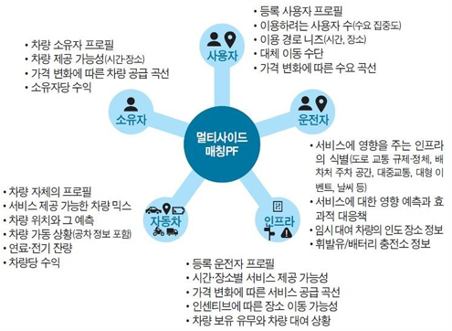

# 미래 모빌리티 트렌드

## 1. 자동차 산업의 변화 (CASE)  

### 1.1 CASE 개념  
- **Connected:**  
  - BMW Connected Drive, GM OnStar, Mercedes Me Connect 서비스 제공.  
  - 데이터 기반 서비스 확대, 고객 기반 확대.

- **Autonomous:**  
  - 자율주행 단계: SAE 기준 Lv0 ~ Lv5
    - SAE(Society of Automotive Engineers): 미국 자동차 공학회
    - 현재 Lv2 (ADAS, Advanced Driver Assistance System) 대중화, 향후 Lv3 일부 확산 예상.  
    - Lv4~5: 완전 자율주행, 현재 기술 개발 중.  
  - 기술적 요소:  
    - 인식: 센서, 정밀지도, V2X 통신  
    - 판단: AI, 딥러닝  
    - 제어: ADAS, ITS
    
     

- **Shared/Service:**  
  - MaaS (Mobility as a Service): 차량 소유에서 이용으로 전환.  
  - 다양한 공유 경제 모델 등장 (승차 공유, 차량 공유, 렌터카 등).  

   

- **Electric:**  
  - 주요 국가 내연기관 판매 금지 일정:  
    - 미국 캘리포니아: 2035년  
    - EU: 2035년 신차 무공해 차량 100%  
    - 노르웨이: 2025년  
  - 전기차 배터리 가격 하락 추세.  

### 1.2 CASE 기반 자동차의 미래 전망  

- **산업 구조의 변화:**  
  - 전통적인 완성차 업체에서 IT, 통신, 에너지 기업과의 협업으로 산업 경계가 무너짐.  
  - 자동차는 '이동 수단'을 넘어 '이동 가능한 생활 공간'으로 진화.

- **새로운 가치 창출:**  
  - Connected 기술로 실시간 교통 정보, 콘텐츠 소비, 개인 맞춤형 서비스 제공.  
  - Autonomous 기술로 이동 시간의 생산성 향상, 새로운 여가·업무 공간 창출.  
  - Shared Mobility로 차량 소유 개념 감소, 비용 절감과 도시 공간 효율화 실현.  
  - Electric 기술로 환경 오염 감소, 지속 가능한 에너지 활용 확대.

- **수익 모델의 변화:**  
  - 하드웨어 판매 수익에서 서비스·플랫폼 기반 구독 모델로 전환.  
  - 차량용 인포테인먼트, 광고, 데이터 수집 및 분석을 통한 부가 수익 창출.

- **기술 발전 방향:**  
  - 인공지능, 클라우드, 5G 네트워크, 고성능 반도체 기술이 융합되어 자율주행, 커넥티비티 강화.  
  - OTA(Over-The-Air) 업데이트로 차량 소프트웨어 지속 개선.  
  - 에너지 효율성과 안전성을 고려한 배터리, 충전 인프라 기술 혁신.

   

---

## 2. 모빌리티 비즈니스의 변환  
- 모빌리티 비즈니스 : 이동성(Mobility)을 중심으로 다양한 서비스를 제공하는 산업업
- 로보택시 도입으로 차량 보유에서 서비스 이용 전환 가속화.  
- 트럭 플래투닝 기술로 물류 효율 향상, 인력 비용 절감.  
- V2G (Vehicle to Grid): 전기차가 전력망에 전력 공급 가능.  
- 충전 인프라 확대 및 에너지 서비스와 통합.  
 

- 차량용 인포테인먼트:  
  - 몰입형 AR/VR 콘텐츠, 위치 기반 광고, 음악·교육 콘텐츠 제공.  
  - 5G 기술로 빠른 데이터 통신 실현.  

     

### 2.1 멀티사이드 매칭 플랫폼(Multi-sided Matching Platform)  

- **정의:**  
  - 여러 그룹의 사용자(공급자와 수요자, 또는 다양한 서비스 제공자와 사용자)를 한 플랫폼 내에서 매칭하여 상호 가치를 창출하는 비즈니스 모델.  
  - 대표 사례: Uber, Grab, 카카오모빌리티, Didi Chuxing  

- **특징:**  
  - 네트워크 효과(Network Effect):  
    - 플랫폼 참여자가 많을수록 가치가 증가.  
    - 예: 승객이 많아질수록 운전자는 더 많은 수익 기회를, 승객은 빠른 배차 혜택을 받음.  

  - 양면시장(Bi-directional Market):  
    - 운송 수단 제공자(드라이버)와 사용자(승객) 모두 플랫폼의 고객이자 파트너.  

  - 수익모델 다양화:  
    - 단순 운송 요금 외에도 프리미엄 서비스, 광고, 금융·보험 상품, 인포테인먼트 서비스로 확장 가능.  

  - 플랫폼 독점화 경향:  
    - 초기 시장에서는 치열한 점유율 경쟁 후, 독과점적 지위 형성.  
    - 고객 락인(Lock-in) 전략과 충성도 프로그램 운영.  

- **핵심 성공 요소:**  
  - 안정적이고 직관적인 사용자 인터페이스(UI)  
  - 신뢰성 높은 매칭 알고리즘 (AI 기반 수요 예측, 최적 경로 제공)  
  - 빠르고 정확한 결제 시스템, 다양한 결제 옵션  
  - 적극적인 파트너십 전략 (로컬 업체, 금융기관, 콘텐츠 사업자 등)  

     

### 2.2 지역별 모빌리티의 미래

- 상하이 미래 모빌리티 조사해보고 그에 대해 프로젝트를 진행 
- [중국 모빌리티 변화 프로젝트 링크](https://github.com/ts5516/Hyundai-EmbeddedSW-School/blob/master/%EB%AF%B8%EB%9E%98%20%EB%AA%A8%EB%B9%8C%EB%A6%AC%ED%8B%B0%20%ED%8A%B8%EB%A0%8C%EB%93%9C/%ED%94%84%EB%A1%9C%EC%A0%9D%ED%8A%B8/%ED%8C%8C%EC%9D%BC/Project_%EC%A4%91%EA%B5%AD%EB%AF%B8%EB%9E%98%EB%AA%A8%EB%B9%8C%EB%A6%AC%ED%8B%B0%EB%B3%80%ED%99%94.pdf)
- 프로젝트 발표 모습

     

---
## 3. 패러다임 변환 주요 기술  

### 3.1 전기자동차 (EV)  

- **기술 발전 현황:**  
  - 배터리 기술의 발전으로 주행거리 증가 (초기 135km → 현재 400km 이상).  
  - 테슬라, 현대, GM 등의 주요 전기차 모델 다수 출시.  
  - 전기차 핵심 부품: 배터리(리튬이차전지), 전기모터, 인버터/컨버터, BMS.  

- **글로벌 시장 동향:**  
  - 주요 국가 내연기관차 판매 금지 로드맵 추진.  
  - 리튬이차전지 가격 하락:  
    - 2013년 $660/kWh → 2025년 예상 $86/kWh → 2030년 $61/kWh 예상.  
  - 2030년경 전기차와 내연기관차의 제조원가 역전 전망.  

- **향후 과제:**  
  - 충전 인프라 확충, 배터리 기술 개선(고체전지 등), 전기차 보조금 정책 유지 여부.  

- **캐즘 이론:**  
  - '캐즘(Chasm)'은 혁신 제품이나 신기술이 시장에 확산되는 과정에서 초기 수용자(Initial Adopters)와 대중 시장(Mainstream Market) 사이에 존재하는 큰 장벽을 의미.  

- **전기차 시장의 캐즘 현상:**  
  - 전기차 초기 시장에서는 테슬라와 같은 브랜드를 선호하는 기술 친화적 소비자들이 주도.  
  - 그러나 일반 소비자는 여전히 높은 가격, 충전 인프라 부족, 짧은 주행거리, 배터리 안전성 문제 등으로 인해 구매를 주저.  
  - 2023~2025년이 캐즘 극복의 분수령이 될 전망.

     

---

### 3.2 수소자동차 (FCEV)  

- **기술 개요:**  
  - 수소와 산소의 화학 반응을 통해 전기를 생산, 이를 이용해 주행.  
  - 전기차와 유사한 구동 방식이지만, 수소 연료전지를 사용.

     

- **장점:**  
  - 긴 주행거리 (현대 넥쏘: 600km), 빠른 충전 속도 (5분 이내).  
  - 장거리 운송 및 상용차 분야에 적합.  

- **한계:**  
  - 높은 제조 비용, 낮은 시스템 효율 (수소차 39% vs 전기차 75%).  
  - 수소 충전 인프라 부족, 수소 생산 비용 높음.
  - 현재 그레이수소 상태로 화석연료를 통해 생산된 수소여서 친환경 제조 방식이 아님

- **향후 발전 방향:**  
  - 블루수소, 그린수소 생산 확대를 통한 친환경성 확보.  
  - 대형 상용차, 물류 시장에서 점진적 확대 예상.  

---

### 3.5 전기 자동차 vs 수소 자동차

- **전기차(테슬라 model 3) vs 수소차(현대 nexo)**

     

- **세부 구분**

    | 구분  | HEV (하이브리드)       | PHEV (플러그인 하이브리드) | EV (전기차)    | FCEV (수소전기차)     |
    |-------|------------------------|----------------------------|----------------|-----------------------|
    | 연료  | 휘발유 + 전기          | 휘발유 + 전기 (외부 충전)  | 전기만 사용    | 수소                  |
    | 충전  | 엔진/회생제동으로 충전  | 외부 전원 + 엔진 충전      | 외부 전원      | 수소충전소에서 수소 주입 |
    | 전기 주행 거리 | 짧음 (보조적)        | 50~100km                   | 300km 이상     | 600km 이상 (넥쏘)    |
    | 탄소 배출 | 있음                  | 있음 (전기 주행시 없음)   | 없음           | 없음                  |
    | 장점  | 연료 효율 증가, 충전 인프라 불필요 | 전기 주행 가능, 연료비 절감 | 무공해, 저렴한 운행 비용 | 긴 주행거리, 빠른 충전 |
    | 단점  | 전기 주행 거리 한계     | 높은 배터리 무게와 비용    | 충전 인프라 부족, 긴 충전 시간 | 수소 인프라 부족, 높은 비용 |

---

### 3.3 도심 항공 모빌리티 (UAM)  

- **기술 현황:**  
  - eVTOL(전기 수직 이착륙 비행체) 개발 활발.  
  - 드론과 항공기 기술을 접목한 도심 내 단거리 이동 수단.  

- **시장 전망:**  
  - 2020년 26억 달러 → 2030년 91억 달러 성장 전망.  
  - 2040년까지 1조 5천억 달러 시장 형성 예상.  

- **기술적 과제:**  
  - 배터리 성능, 자율비행 기술, 소음 저감, 안전 인증 및 항공 교통 관리 시스템 개발 필요.  

- **주요 기업:**  
  - 현대자동차, 보잉, 에어버스, Uber, Volocopter, Joby Aviation 등.  

---

### 3.4 하이퍼루프 (Hyperloop)  

- **기술 개요:**  
  - 진공 튜브 내에서 캡슐 형태의 차량(Pod)이 시속 1,200km로 이동.  
  - 초고속 대량 수송 수단으로 서울-부산 20분 이동 가능 예상.  

- **기술적 과제:**  
  - 진공 유지 기술, 안전성 확보, 고비용 인프라 구축 문제.  
  - 노선 구축에 따른 경제성 확보가 상용화의 핵심 과제.  

- **시장 동향:**  
  - Virgin Hyperloop One, VTT 등 주요 기업 개발 진행 중.  
  - 국내에서도 서울-부산 간 하이퍼루프 프로젝트 검토 중.  

- **향후 전망:**  
  - 물류, 여객 수송의 패러다임을 바꿀 미래형 교통수단으로 기대되나, 상용화까지는 상당한 시간 소요 예상.  

- **장점**

     

---

## 4. SDV (Software-Defined Vehicle) & 차량용 OS  

- SDV: 하드웨어 의존도를 줄이고, 소프트웨어로 기능 구현.  
- 주요 OS: QNX, Android Auto, Apple CarPlay, AGL.  
- 실시간 처리, 보안, OTA 업데이트가 핵심.  

     

- SDV 구현을 위한 핵심요소

     

- 차량용 OS 시장 구성

     
---

## 5. 모빌리티 서비스  

### 5.1 모빌리티 서비스의 개념  
- 기존 ‘교통수단’ 개념에서 벗어나, ICT, 에너지, 인포테인먼트, 자율주행 등과 융합하여 편리하고 효율적인 이동을 제공하는 서비스.  
- 4차 산업혁명 기술 발전과 사회·경제적 변화로 기존 교통 서비스는 빠르게 새로운 형태로 전환되고 있음.  
- 이를 **모빌리티 서비스 혁신(Mobility Service Innovation)** 이라 정의함.

---

### 5.2 현재 교통체계의 문제점

#### 1. 편리성

| 구분      | 승용차 (유/불리)      | 대중교통 (유/불리)         |
| ------- | --------------- | ------------------- |
| 접근성     | 유리: 시간·장소 구애 없음 | 불리: 노선·배차 간격 제한     |
| 노동 강도   | 불리: 직접 운전 부담    | 중간: 환승 부담, 반복 요금 발생 |
| 이동 후 관리 | 불리: 주차, 유지보수 필요 | 유리: 이용 후 관리 필요 없음   |

#### 2. 신속성

| 구분    | 승용차 (유/불리)            | 대중교통 (유/불리)                    |
| ----- | --------------------- | ------------------------------ |
| 공급    | 불리: 도로 용량 부족, 설계 미흡   | 유리: 도시철도 절대적 통행우선권, 일부 버스 전용차로 |
| 연계성   | 유리: 연계 문제 없음          | 불리: 환승 시 연계 비효율로 인한 지연         |
| 접근성   | 중간: 일부 지역 도로율 낮음      | 불리: Last Mile 문제로 인한 불편        |
| 운영 관리 | 불리: 비효율적 도로 운영, 사고 처리 | 불리: 비효율적 노선 설계, 배차 간격 문제       |

#### 3. 안전성 / 환경성

| 구분     | 승용차 (유/불리)           | 대중교통 (유/불리)         |
| ------ | -------------------- | ------------------- |
| 시설적 요인 | 불리: 도로 설계 미흡, 조명 부족  | 중간: 철도 노후화, 버스 안전   |
| 인적 요인  | 불리: 과속, 음주운전, 고령화 문제 | 불리: 운전자의 과로, 난폭 운전  |
| 차량 요인  | 불리: 차량 정비 소홀         | 유리: 정기적 차량 관리 시행    |
| 환경 요인  | 불리: 배출가스 관리 미흡       | 유리: 탄소 배출량 적음, 친환경적 |

#### 4. 쾌적성

| 구분    | 승용차 (유/불리)           | 대중교통 (유/불리)           |
| ----- | -------------------- | --------------------- |
| 보안    | 유리: 사생활 보호, 치안 문제 적음 | 불리: 타인과 접촉, 치안 문제 가능성 |
| 안락함   | 유리: 필요시 휴식 가능        | 불리: 정해진 일정으로 안락함 저하   |
| 여가 활용 | 중간: 주행 중 여가·생산 활동 제한 | 유리: 여가 및 생산 활동 가능     |

---

### 5.3 국내외 공유교통체계 동향  

#### 국내 주요 서비스  
| 기업명        | 시작 연도 | 주요 서비스          |
|----------------|-----------|----------------------|
| 카카오모빌리티 | 2015년    | 택시 호출, 대리운전  |
| 풀러스         | 2016년    | 출퇴근 카풀          |
| 타다           | 2018년    | 기사 포함 렌터카     |
| 쏘카           | 2011년    | 차량 공유 (시간 단위)|  

#### 해외 주요 서비스  
| 기업명        | 시작 연도 | 주요 서비스            |
|----------------|-----------|------------------------|
| 우버 (Uber)    | 2008년    | 승차공유, 음식 배달 등 |
| 리프트 (Lyft)  | 2012년    | 승차공유, 전기자전거   |
| 고젝 (Gojek)   | 2015년    | 오토바이 공유, 음식배달|
| 그랩 (Grab)    | 2012년    | 승차공유, 음식배달     |
| 올라 (Ola)     | 2010년    | 차량 공유              |
| 디디추싱 (DiDi)| 2012년    | 승차공유 (우버 차이나 인수)

---

### 5.4 자율주행을 활용한 스마트 모빌리티  

#### 주요 서비스 사례  
1. **자율주행형 수요응답 대중교통**  
   - 스위스 시옹: Navya社 자율주행 셔틀 ‘Autonom Shuttle’ 운영.

2. **차량과 로봇 결합 운송 서비스**  
   - 프랑스 리옹 공항: 스마트 운송 서비스 운영 (Alpaca pour Stanley).  

### 5.5 스마트 모빌리티 사례 탐색 프로젝트
 - [프로젝트 링크](https://github.com/ts5516/Hyundai-EmbeddedSW-School/blob/master/%EB%AF%B8%EB%9E%98%20%EB%AA%A8%EB%B9%8C%EB%A6%AC%ED%8B%B0%20%ED%8A%B8%EB%A0%8C%EB%93%9C/%ED%94%84%EB%A1%9C%EC%A0%9D%ED%8A%B8/%ED%8C%8C%EC%9D%BC/Project_%EA%B4%91%EC%97%AD%EC%BD%9C%EB%B2%84%EC%8A%A4.pdf)
 - IOT 및 클라우드 기반 스마트 모빌리티(광역콜버스) 사례 탐색 및 발표
- 프로젝트 발표 모습

     

## 6. 한국 자동차 산업의 현황과 대응 전략  

- 2030년까지 전기·수소차 신차 판매 비중 33% 목표.  
- 민간 투자 60조 원, 미래차 생태계 전환 추진.  
- 글로벌 OEM 연계 부품 개발, R&D 투자 확대.  

### 6.1 트렌드에 기반한 사업 모델 파악하기

- [프로젝트 링크](https://github.com/ts5516/Hyundai-EmbeddedSW-School/blob/master/%EB%AF%B8%EB%9E%98%20%EB%AA%A8%EB%B9%8C%EB%A6%AC%ED%8B%B0%20%ED%8A%B8%EB%A0%8C%EB%93%9C/%ED%94%84%EB%A1%9C%EC%A0%9D%ED%8A%B8/%ED%8C%8C%EC%9D%BC/Project_V2X%EC%8A%A4%ED%83%80%ED%8A%B8%EC%97%85%EB%B6%84%EC%84%9D.pdf)
- V2X 관련 스타트업 트렌드 분석 및 관련 사례 발표
- 프로젝트 발표 모습

     

---

## 7. Human-Centered Design in Mobility  

- 사용자 경험, 안전, 편의를 고려한 인간 중심 설계(HCD) 강조.  

- HUD 프로세스 다이어그램

     

---

