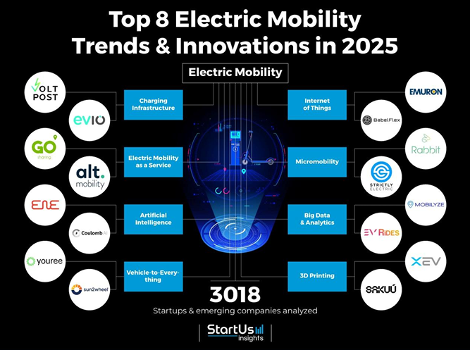

# V2X(Vehicle-To-X) 스타트업 분석

## 프로젝트 개요
- **제목**: V2X 기술 스타트업의 트렌드와 사업 모델 분석
- **팀원**: 윤성준, 유원규, 이건형, 이민희, 유형진, 오태성
- **핵심 스타트업**: Cavnue, Youree  
- **목표**: 미래 교통 인프라 혁신과 가능성 탐색

## 프로젝트 진행 방향
- 이미지의 항목 중 하나를 선택하여 그에 대한 내용 분석, 프로젝트에서는 V2X를 선택.
   

## 주요 내용
### 1. Cavnue – 스마트 도로 구축
- **문제 해결**:
  - 기존 도로의 **자율주행 및 커넥티드 차량** 대응 부족
  - **도로 안전성** 문제 및 교통 혼잡 해결 필요
- **해결 방법**:
  - **스마트도로 구축** → 차량, 보행자, 인프라 간 양방향 통신 실현
  - **V2X 통신 지원** → 실시간 교통관리 시스템 제공
  - **디지털 트윈 기반 교통 예측** → 도로 및 차량 상태 실시간 분석 및 예측
- **사업 모델 및 가능성**:
  - **I-94 프로젝트** (미시간주 앤아버 ↔ 디트로이트, 총연장 63km) 진행 중
  - **세계 최초 커넥티드 및 자율주행 차량 회랑 프로젝트** 추진
  - **Ford, Toyota, GM 등 주요 자동차 제조사와 협력**

### 2. Youree – 스마트 EV 충전 최적화
- **문제 해결**:
  - **전력망 불균형** → 전기차 보급 증가로 인한 전력 수요 급증
  - **충전 비용 불확실성** → 최적 충전 시간 결정 어려움
  - **탄소 배출 관리 어려움** → 충전 중 배출량 추적 필요
- **해결 방법**:
  - **스마트 충전 관리** → 사용자의 이동 패턴과 전력 요금 기반 최적 충전 결정
  - **V2G(Vehicle-to-Grid) 기술** → 전기차 배터리를 활용한 전력망 에너지 공급
  - **탄소 발자국 추적** → 실시간 탄소 배출량 분석 및 환경 영향 시각화
- **사업 모델 및 가능성**:
  - **V2G 기반 모바일 애플리케이션 제공** → 사용자 확대
  - **EV 플릿 운영 기업 대상 충전 최적화 및 에너지 관리 서비스**
  - **전기차 보급 확산 예상** (2030년까지 약 **6,100만대** 판매 예상)
  - **유럽 탄소 감축 정책(Fit for 55)과 연계하여 시장 성장 가능성 높음**

## 결론
- **V2X 기술을 통한 미래형 교통 인프라 혁신 가능**
- **자율주행 및 커넥티드 차량 중심의 스마트 도로 구축**
- **전기차 및 충전 인프라 최적화를 통한 지속 가능한 이동 솔루션 제공**
