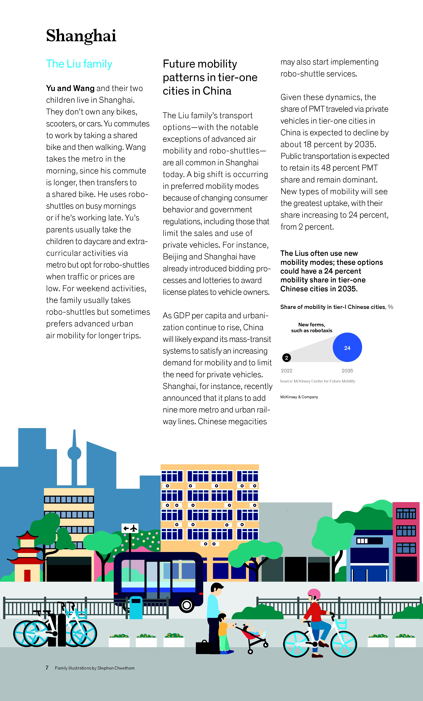

# 중국 대도시의 미래 모빌리티 변화

## 프로젝트 개요
- **제목**: 중국 상하이의 미래 모빌리티 변화
- **팀원**: 윤성준, 유원규, 이건형, 이민희, 유형진, 오태성
- **사례 연구**: Shanghai Liu 가족을 통해 본 상하이 모빌리티 변화

## 프로젝트 진행 방향
- 이미지 분석 후, 상하이에 대한 미래 모빌리티 변화를 팀원들과 같이 예측.
    
     

## 주요 내용
### 1. 도시 및 인구
- 상하이 인구: 약 **2500만명**
- 중앙정부의 도시 규제 강화

### 2. 미래 모빌리티 방향
- **전기차 시장** 경쟁력 확보
- 대륙 면적이 넓어 특이한 발전 방향 필요

### 3. 이동 수단 변화
- **자전거 공유**, 도보, 메트로 및 로보셔틀 활용
- **자동차 소유 없이 생활 가능**
- **주말 이동**: 로보셔틀 및 **도시 항공 이동(UAM)** 사용 증가

### 4. 정부 정책 변화
- **개인 차량 사용 제한** (규제 강화)
- **메트로 및 도시철도 확장**
- **차량 번호판 제한** (베이징/상하이 - 입찰/추첨제)
- **신모빌리티 확산**: 로보셔틀 등 새로운 이동 수단 증가

## 결론
- **중국 대도시 모빌리티는 공유 및 자동화 중심으로 변화**
- **전통적인 차량 소유 개념이 점점 사라지고 있음**
