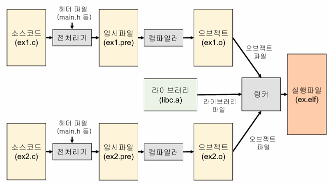

# C 언어 기초 및 프로그램 빌드 과정

## 1. 개발 환경 설정

* **개발 도구**: AURIX Development Studio
* **보드**: Infineon TC375 Lite Kit (KIT\_A2G\_TC375\_LITE)
* **Toolchain**: TASKING C/C++ Compiler

### 프로젝트 세팅 실습

* ADS 및 UDE 설치 후 프로젝트 Import 및 Build
* UDE를 통해 디버깅 인터페이스(DAP)로 보드 연결
* 실행파일을 다운로드 후 시리얼 통신(PuTTY)으로 결과 확인

---

## 2. 입출력 함수 사용 실습

* `my_printf()`, `my_scanf()`를 이용한 시리얼 기반 입출력
* 변환 지정자(%d, %s 등)와 escape 문자(`\n`, `\t`) 사용
* 문자열, 정수, 문자 입력 후 입력값을 그대로 출력하는 실습 진행

---

## 3. C언어 기본 문법 학습

### 개발 철학 및 특징

* "프로그래머를 신뢰한다", "작고 단순한 언어 구조 유지", "하나의 방식만 제공"
* 절차지향 언어, 시스템 프로그래밍에 적합

### 변수 및 저장 지시어

* 변수는 메모리 공간에 이름을 붙인 것
* `static`: 지역 변수는 블록 종료 후에도 값 유지, 전역 변수는 파일 내에서만 접근
* `register`: 자주 사용하는 변수는 CPU 레지스터에 저장 요청
* `volatile`: 외부 요인에 의해 바뀔 수 있는 변수는 최적화에서 제외

### 연산자 우선순위

* 괄호가 가장 우선, 이후 산술 > 관계 > 논리 > 대입 > 쉼표 순
* 모호한 경우 괄호로 우선순위 명시

---

## 4. 조건문과 어셈블리 분석

### if-else vs switch-case

* 동일한 조건 분기를 각각 구현하여 어셈블리 코드로 비교
* `switch-case`는 jump table로 최적화될 수 있어 효율적일 수 있음

---

## 5. 전처리기와 조건부 컴파일

### 전처리기

* `#define`, `#include`, `#ifdef` 등 텍스트 수준의 전처리 지시어 처리

### 조건부 컴파일 vs if-else

* 조건부 컴파일: 컴파일 시점에 코드 선택, 실행 속도 빠름, 실행파일 크기 작음
* if-else: 런타임 조건 판단, 유연성 높음, 실행파일 크기 큼

### 실습 결과

* `.text` 및 `.data` 영역 모두 조건부 컴파일이 더 작음

---

## 6. 프로그램 빌드 과정

### 전체 빌드 단계

1. **전처리기**: `#` 지시어 처리 → 임시파일(.i) 생성
2. **컴파일러**: 어셈블리(.s) 또는 오브젝트 파일(.o) 생성
3. **어셈블러**: 어셈블리 코드를 오브젝트 파일로 변환 (보통 컴파일러가 포함)
4. **링커**: 여러 오브젝트 파일과 라이브러리를 묶어 실행파일(.elf, .exe) 생성



---

## 7. 정적 라이브러리 실습

### 라이브러리 프로젝트 생성

* `my_lib` 프로젝트를 새로 만들고, `mylib_calc.c`, `mylib_calc.h` 파일 작성
* 사칙연산 함수 (`add`, `sub`, `mul`, `div`) 구현 후 빌드 → `my_lib.a` 생성

### 실행 프로젝트에 라이브러리 연동

* 기존 실행 프로젝트에서:

  * **Include Path**에 라이브러리 헤더 경로 추가
  * **Linker > Libraries**에 `my_lib.a` 파일 경로 추가

### 실행 결과

* main 함수에서 `add(1,2)` 등 호출
* 시리얼 터미널(PuTTY)에서 다음과 같이 출력 확인:

  ```
  ADD(1,2)=3
  SUB(1,2)=-1
  MUL(2,2)=4
  DIV(2,2)=1
  ```

---

## 마무리

* AURIX 기반 임베디드 개발 환경 구성부터 빌드, 디버깅, 조건부 컴파일, 라이브러리 적용까지 실습
* 각 단계를 통해 C언어의 구조적 개념과 MCU 소프트웨어 개발 흐름을 이해
