# TC375 이해 및 GPIO 실습

---

## Aurix TriCore MCU 명명 규칙

- 예시 모델: **TC375TP-96F300W**
- TC: TriCore 시리즈
- 375: 시리즈 번호
- T: Triple Core 아키텍처
- P: Production Dev., HSM Enabled
- 96: Flash Size 6MB
- F: Memory Type
- 300: Frequency
- W: LQFP 0.5mm pitch
- 온도 범위:  
  - K: -40℃ ~ +125℃  
  - L: -40℃ ~ +150℃
- 패키지 타입: LQFP-176 사용 (5)
- 코어 아키텍처: Triple Core (T)

---

## TC375 Lite Kit (실습 보드)

- 제조사: Infineon
- 보드명: TC375 Lite Kit
- MCU: Aurix TC375TP
- 특징:
  - Arduino Due IO 커넥터 핀 호환
  - USB(Micro 5pin) 디버깅 인터페이스 지원
  - 동작 전원: DC 5V
  - Micro 5pin 케이블로 전원 공급 및 디버깅 가능

---

## 실습용 보드

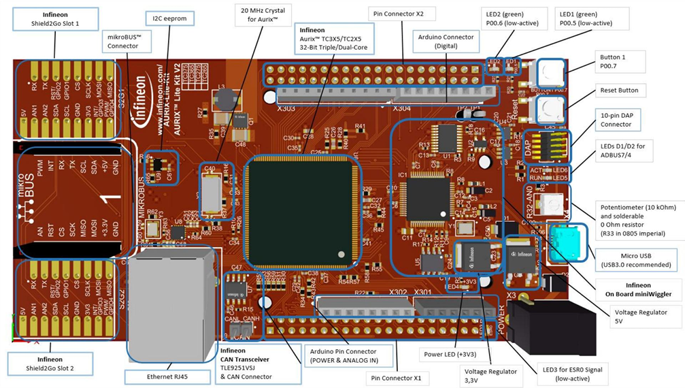

- 지원 주변기기 목록:
  - ADC (Analog-to-Digital Converter)
  - GPT (General Purpose Timer)
  - ASCLIN (Async/sync Serial Controller with LIN)
  - CAN (Controller Area Network)
  - GTM, STM, CCU6, SPI, Ethernet 등

- 보드 핀 배치 요약:
  - LED1, LED2 연결 핀
  - PWM 제어 핀
  - RGB LED, Buzzer, 스위치(SW1, SW2) 핀
  - 가변 저항 및 광센서 위치 확인 가능

- Easy Module Shield 연결 포인트는 보드 양쪽 측면의 핀 헤더를 통해 식별 가능

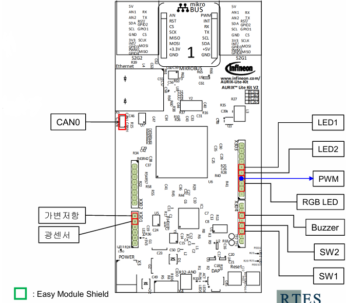

### 회로도

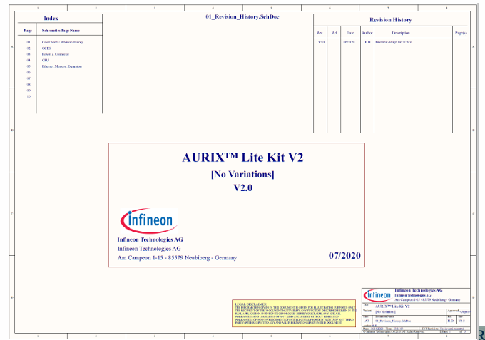
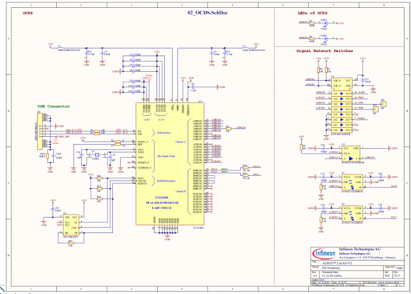
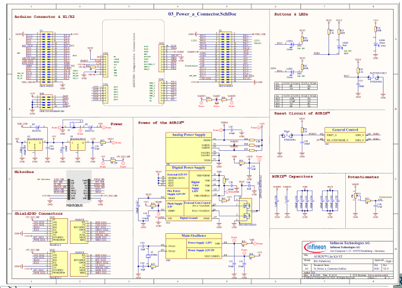
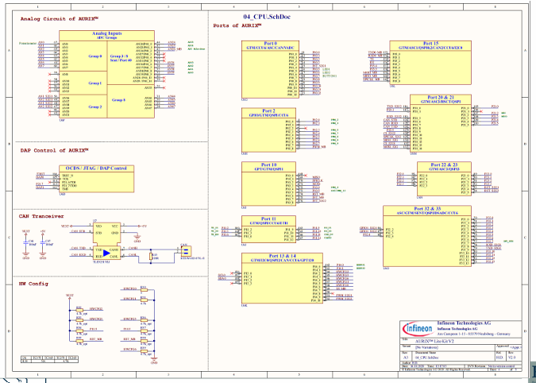
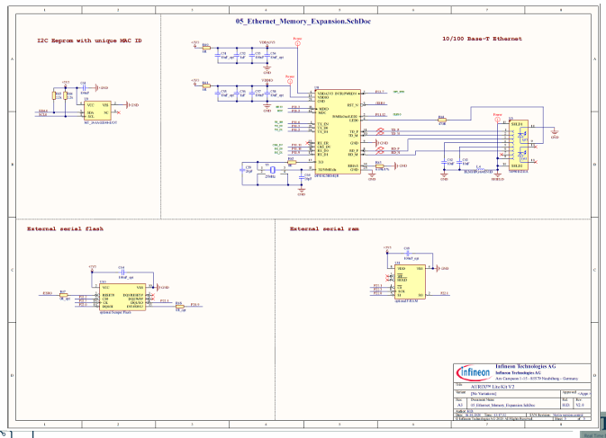

---

## 제어기 회로 관련 용어

- **PCB (Printed Circuit Board, 인쇄회로기판)**  
  - 도체와 절연체가 기판 형태로 적층되어 있으며, 반도체·캐패시터 등 다양한 부품 장착 가능  
  - 전기 신호를 효율적으로 설계할 수 있도록 하여 전자기기의 크기를 줄이고 성능 및 생산성을 향상시킴

- **회로도**  
  - PCB의 각 부품을 어떻게 연결할 것인지 설계한 도면  
  - 부품의 종류나 크기와 관계없이 부품 간 연결만 정의

- **PCB 레이아웃**  
  - 회로도를 기반으로 실제 PCB 상에 부품을 배치하고 연결하는 작업

- **SMT (Surface Mount Technology)**  
  - 장비를 통해 PCB 기판에 부품을 자동으로 조립하는 기술

---

## 확장 센서 보드 (Easy Module Shield)

- TC375 Lite Kit 보드와 결합 가능한 확장 보드
- 구성 요소:
  - 가변 저항
  - LED x 2
  - 부저 (Buzzer)
  - 스위치 버튼 x 2
  - 적외선 센서 모듈
  - 온습도 센서 모듈
- 확장 보드는 핀 헤더를 통해 메인 보드와 직접 연결 가능

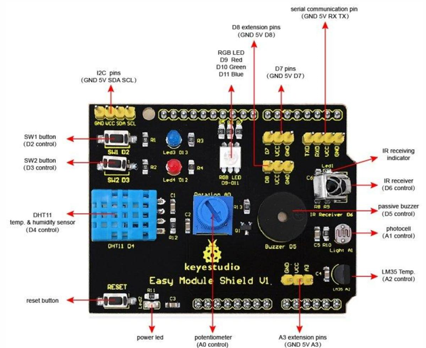

### 회로도

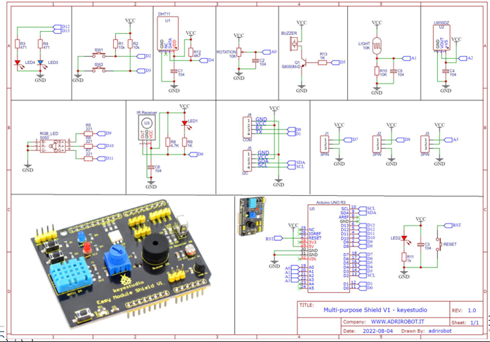

---

## 모터 드라이버

- DC 모터를 PWM 방식으로 제어하기 위한 드라이버
- 사용 모델: **L298P**
- 드라이버 쉴드 모델: **Arduino Motor Shield Rev3**
  - DC 모터 최대 전류: 각 채널당 2A
  - DC 모터 제어 채널 수: 2개
  - 작동 전압: DC 5V ~ 12V

---

## DC 모터 (Encoder 내장)

- 모델명: **MB2832E-1268**
- 정격 전압: DC 12V
- 회전 속도: 5,450 rpm
- 정격 토크: 54.4 gf·cm
- 정격 전류: 0.44 A
- 엔코더 내장형 모터지만, 실습에서는 엔코더 기능 사용하지 않음
  - 엔코더는 회전수, 속도, 각도 등을 감지하는 센서

---

## 초음파 센서 모듈

- 모델명: **HC-SR04**
- 기능: 초음파를 발사 후 수신까지 걸린 시간으로 거리를 계산
- 측정 거리: 2 ~ 500 cm
- 해상도 (Resolution): 0.3 cm
- 핀 설명:
  - VCC: 5V DC 전원
  - Trig: 초음파 발신 요청
  - Echo: 수신까지 소요된 시간 출력
  - GND: 접지

---

## 블루투스 통신 모듈

- 모델명: **HC-05**
- 블루투스 버전: 2.0
- 기본 통신속도: 9600 baud rate
- 입력 전압: 5V
- 동작 전압: 3.3V
- 민감도: -80 dBm
- 전송 거리: 최대 10M

---

## 레이저 센서

- 모델명: **TOFSense**
- 적외선 기반 근접 센서 (파장: 940nm)
- 통신 인터페이스:
  - UART: 921600 baudrate
  - CAN: 최대 1Mbps
- 올바른 커넥터를 사용해야 연결 가능 (케이블 구분 필요)

---

## TC375 구조

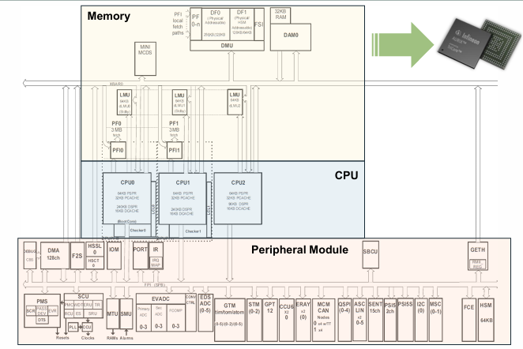

- TC375는 세 영역으로 구성됨:
  - **Memory 영역**: 코드, 데이터, 캐시 메모리 포함 (e.g. LMU, PSPR, DLMU, DAM 등)
  - **CPU 영역**: 3개의 코어 (CPU0, CPU1, CPU2)로 구성되며, 각 코어는 자체 PSPR과 캐시를 가짐
  - **Peripheral Module 영역**: 다양한 주변장치와 I/O 모듈 포함 (e.g. DMA, GTM, SPI, CAN, ASC 등)

---

## Core 레지스터 구성

- **범용 레지스터(GPR)**: 총 32개
  - 주소 레지스터(A0~A15) 16개
  - 데이터 레지스터(D0~D15) 16개

- **시스템 레지스터**: 총 3개
  - **PCXI** (Previous Context Information Register)
  - **PSW** (Program Status Word)
  - **PC** (Program Counter)

---

## 특수 기능 레지스터

- **암시적(implicit) 레지스터**
  - 대부분의 16비트 명령어는 두 개의 특수 레지스터를 사용
  - **A15**: 암시적 주소 레지스터
  - **D15**: 암시적 데이터 레지스터

- **A[10]**: 스택 포인터 (SP) 레지스터  
  - 현재 명령어가 수행되고 있는 함수의 주소 저장

- **A[11]**: 복귀 주소 (RA) 레지스터  
  - 함수 종료 후 이전 함수의 다음 명령어 주소 저장

---

## 전역(Global) 레지스터

- 전역 레지스터는 상/하위 컨텍스트에 포함되지 않음
  - 함수 호출, 트랩, 인터럽트 간에 저장 및 복원되지 않음
  - 주로 운영체제에서 시스템 오버헤드를 줄이기 위한 용도

- 주요 전역 레지스터
  - **A[0]**: Small data section base pointer
  - **A[1]**: Literal data section base pointer (예: "Hello")
  - **A[8], A[9]**: 확장 주소 모드용 베이스 레지스터

---

## TC375 함수 스택

- **스택 종류**
  - **Global Stack (iStack)**: 인터럽트 서비스 루틴에서 사용하는 스택
  - **User Stack (uStack)**: 일반 함수 호출 시 사용하는 사용자 스택
  - 스택 크기는 `Lcf_Tasking_Tricore_Tc.lsl` 파일에서 설정 가능
    - 예시:
      ```c
      #define LCF_USTACK0_SIZE 2k
      #define LCF_ISTACK0_SIZE 1k
      ```

---

## TC375 스택 관리 레지스터

- **A[10] (SP)**: 현재 함수가 사용하는 스택 포인터
- **ISP (Interrupt Stack Pointer)**: 인터럽트 발생 시 사용할 스택 주소
- **PSW (Program Status Word) 레지스터**:
  - PSW의 IS 필드가 어떤 값을 갖느냐에 따라 스택 선택 결정
    - IS = 0: Interrupt Stack (iStack) 사용
    - IS = 1: User Stack (uStack) 사용
  - 인터럽트가 발생했을 때 IS 비트가 0이면, ISP의 값이 스택 포인터로 사용됨

---

## 바이트 정렬

- 메모리에 데이터를 저장할 때, 연속된 바이트들을 어떤 순서로 배치할지를 결정하는 방식

- **리틀 엔디안 (Little-Endian)**  
  - 데이터의 **낮은 바이트(LSB)**부터 메모리에 저장  
  - 예: 0x12345678 → 78 56 34 12 순으로 저장

- **빅 엔디안 (Big-Endian)**  
  - 데이터의 **높은 바이트(MSB)**부터 메모리에 저장  
  - 예: 0x12345678 → 12 34 56 78 순으로 저장

- **TriCore 1.6 아키텍처**는 **리틀 엔디안 방식** 사용

- 데이터 단위별 구성:
  - **Byte**: 1 byte
  - **Word**: 2 bytes
  - **Half-word**: 4 bytes
  - **Double-word**: 8 bytes

---

## Memory Mapped I/O

- **메모리와 I/O를 동일한 주소 공간에 배치하는 방식**
  - 물리 메모리 주소를 I/O 장치에 매핑하여 입출력 장치에 접근
  - 입출력 장치를 메모리처럼 다룰 수 있어 별도의 명령어나 인터페이스가 불필요

- **TC375은 MMIO 방식을 사용**
  - I/O 장치도 메모리 주소처럼 접근 가능
  - 일반적인 LOAD/STORE 명령으로 레지스터 또는 I/O 장치 접근 수행

- **이점**
  - 명령어 집합의 단순화
  - 하드웨어 제어의 유연성 향상
  - I/O 제어와 메모리 접근 방식의 일관성 유지

### TC375 Memory Map

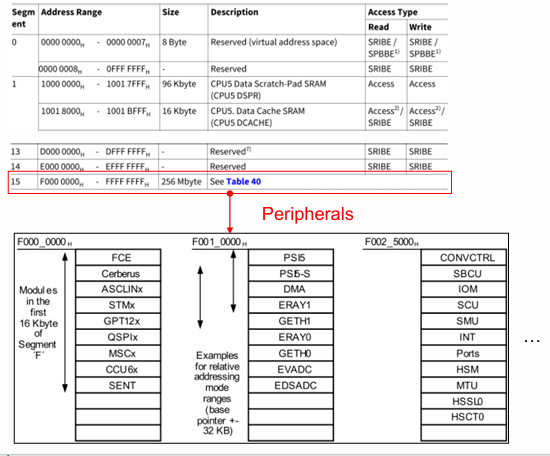

---

## 비트 조작

- **clear / set 연산**
  - `clear`: 특정 비트를 0으로 설정 → `a & ~(1 << n)`
  - `set`: 특정 비트를 1로 설정 → `a | (1 << n)`
  - 예: `a & 0 = 0`, `a & 1 = a`, `a | 0 = a`, `a | 1 = 1`

- **하드웨어 제어 시 비트 조작 활용**
  - `n`번째 비트를 0으로 clear: `Var & ~(1 << n)`
  - `n`번째 비트를 1로 set: `Var | (1 << n)`
  - `n`번째 비트를 추출: `(Var >> n) & 0x01`
  - `n`번째 비트를 반전: `Var ^ (1 << n)`

## 비트 조작 예제 (clear, set, 반전)

```c
int main(void) {
    unsigned char a = 0x82;
    SYSTEM_Init();

    my_printf("a= 0x%X\n", a);

    if ((a >> 7) & 0x1) {
        // (1) 8번째 비트 반전
        a = a ^ (1 << 7);
        my_printf("a= 0x%X\n", a);

        // (2) 2번째 비트 clear
        a = a & ~(1 << 1);
        my_printf("a= 0x%X\n", a);

        // (3) 4번째 비트 set
        a = a | (1 << 3);
        my_printf("a= 0x%X\n", a);
    }

    while(1);
    return 0;
}
```

* (1) `a ^ (1 << 7)` → 비트 반전 (XOR)
* (2) `a & ~(1 << 1)` → 비트 clear (AND + NOT)
* (3) `a | (1 << 3)` → 비트 set (OR)

---

## T## TC375 구조체 활용 예

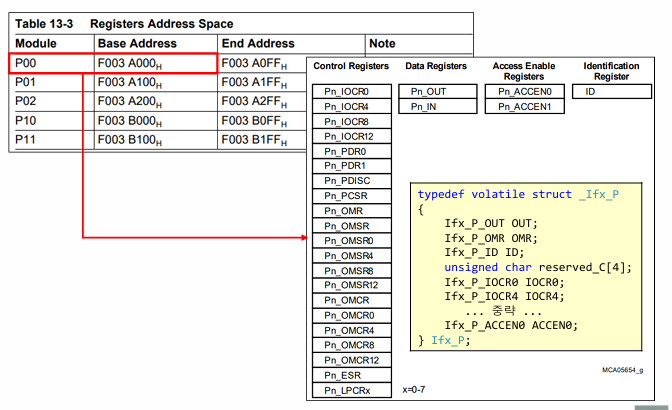

- 하드웨어 레지스터를 **C 언어의 구조체**로 정의하여 접근

- 예시: Port 0의 IOCR0 레지스터 구조체 정의

- IOCR0는 총 32비트이며, **PC0 ~ PC3 필드**만 사용되고 나머지는 Reserved

- 실제 소스코드 내 구조체 정의 예시:
```c
typedef struct {
    Ifx_UReg_32Bit reserved_0:3;  // [2:0] Reserved
    Ifx_UReg_32Bit PC0:5;         // [7:3] Port Control for Pin 0
    Ifx_UReg_32Bit reserved_8:3;  // [10:8] Reserved
    Ifx_UReg_32Bit PC1:5;         // [15:11] Port Control for Pin 1
    Ifx_UReg_32Bit reserved_16:3; // [18:16] Reserved
    Ifx_UReg_32Bit PC2:5;         // [23:19] Port Control for Pin 2
    Ifx_UReg_32Bit reserved_24:3; // [26:24] Reserved
    Ifx_UReg_32Bit PC3:5;         // [31:27] Port Control for Pin 3
} Ifx_P_IOCR0_Bits;
````

* 구조체로 정의하면:

  * 특정 비트 필드를 명확히 분리 가능
  * 비트 단위 설정/읽기가 쉬워짐
  * 유지보수 및 가독성 향상

```

### 구조체 기반 레지스터 정의

- `Ifx_P` 구조체는 포트 전체를 나타내며, IOCR 레지스터 등 여러 하위 구조체를 포함
- IOCR0는 `Ifx_P_IOCR0`로 접근하며 내부에 `.U` (unsigned int 전체 접근)와 `.B` (비트 필드 접근) 존재
- `IOCR0.B.PC0`처럼 각 비트를 의미 있는 이름으로 접근 가능

### 공용체 및 구조체 조합 사용 예시

```c
#include "main.h"

Ifx_P* const pPort = (Ifx_P*)0xF003A000u;

pPort->IOCR0.B.PC0 = 0x10;
pPort->IOCR0.B.PC1 = 0x11;
pPort->IOCR0.B.PC2 = 0x12;
pPort->IOCR0.B.PC3 = 0x14;

my_printf("IOCR0 = %X\n", pPort->IOCR0.U);
```

* `IOCR0.B.PC0 = 0x10`은 비트 단위 접근
* `IOCR0.U`는 전체 32비트 접근
* 해당 주소 0xF003A000u에 직접 구조체 포인터를 매핑하여 사용

### 구조체를 사용하는 이유

* 구조체를 사용하면 가독성이 높고 명확한 레지스터 접근이 가능
* 예시 비교:

```c
// 구조체 없이 직접 주소 지정
*(unsigned char*)0xF003A013u = 0x10;  // PC0에 접근하지만 어떤 레지스터인지 불분명

// 구조체 사용
MODULE_P00.IOCR0.B.PC0 = 0x10;       // 어떤 포트의 어떤 비트를 쓰는지 명확
```

* 구조체 없이 접근할 경우 유지보수나 디버깅 시 가독성 떨어짐

### 구조체 활용 비교 예시 (CAN 모듈)

```c
// 구조체 사용
#define CAN0 (*(MODULE_CAN*)0xFFFFF00)
CAN0.reg1 = 10;
CAN0.reg2 = 20;
CAN0.reg3 = 30;
```

```c
// 구조체 미사용
unsigned int* MODULE_CAN_reg1 = (unsigned int*)0xFFFFF00;
*MODULE_CAN_reg1 = 10;
```

* 구조체 사용 시 명확하고 재사용이 쉬운 코드 가능
* 포인터 계산 및 오프셋 추론 없이 의미 있는 이름으로 접근 가능

---

## GPIO 개요

- **GPIO (General Purpose Input Output)**  
  - 범용 입출력 핀으로, 외부 장치와의 **디지털 신호** 제어에 사용됨
  - 사용 예시: LED, 스위치, Serial/CAN 통신 등

- **입출력 신호 특성**
  - 디지털 신호: `1` 또는 `0`으로 표현
  - 전압 기준:
    - High (`1`): 3.3V 또는 5V
    - Low (`0`): 0V
  - 풀업(pull-up), 풀다운(pull-down) 구성에 따라 기본 전압 상태 결정

- **예시**
  - 출력 핀이 `0`이면 LED 꺼짐
  - 출력 핀이 `1`이면 LED 켜짐
  - 사용자가 소프트웨어로 핀의 동작을 제어 가능

- **구성도**
  - GPIO 핀은 내부적으로 Port Module의 레지스터(IOCRx, INx, OUTx 등)를 통해 제어됨
  - CPU는 메모리 매핑된 레지스터를 통해 GPIO 회로에 명령 전달

---

## Port 모듈 출력 예시 (LED 제어)

- **목표**: Port 10.2 핀을 이용해 LED1을 켜기

### 제어 흐름

1. **IOCR 레지스터 설정**
   - Port 10의 제어 레지스터(`P10_IOCRx`)에 2번 핀을 **출력(Output)** 모드로 설정

2. **OUT 레지스터에 값 쓰기**
   - `P10_OUT` 레지스터의 2번 비트에 `1`을 기록 → 해당 핀에 High(3.3V) 출력

3. **LED 점등**
   - P10.2 핀을 통해 LED1에 전압 공급 → LED1 켜짐

### 구성 요약

- **레지스터**
  - IOCR: 각 핀의 입출력 모드 설정 (e.g. `IOCR0.B.PC2 = 0x10`)
  - OUT: 핀의 실제 출력값 설정 (e.g. `OUT.B.P2 = 1`)

- **실습 보드 연결**
  - P10.2 ↔ LED1 연결되어 있음
  - IOCR → OUT → 실제 전류 흐름 → LED 점등

---

## IOCR (입출력 제어 레지스터)

- 특정 **pin의 입출력 모드**를 설정하는 레지스터
- 총 4개의 IOCR 레지스터 존재: IOCR0, IOCR4, IOCR8, IOCR12

| 핀 번호 범위 | 사용 레지스터 |
|--------------|----------------|
| 0 ~ 3번 핀   | IOCR0 |
| 4 ~ 7번 핀   | IOCR4 |
| 8 ~ 11번 핀  | IOCR8 |
| 12 ~ 15번 핀 | IOCR12 |

- 각 IOCR의 비트 필드: 5비트 단위로 하나의 핀 제어 (e.g. PC0 ~ PC3)

---

## Pn_IN (입력 레지스터)

- **GPIO 핀의 입력 논리값**을 읽을 수 있는 읽기 전용 레지스터

- 레지스터 구성:
  - 비트 0~15: 각 핀의 입력값 (Px)
    - `0`: 입력값이 Low
    - `1`: 입력값이 High
  - 비트 16~31: Reserved (읽으면 0)

- 예시:
  - `P10_IN.P2 == 1` → P10.2 핀이 High 상태

---

## Pn_OUT (출력 레지스터)

- **GPIO 핀에 출력할 값을 기록**하는 레지스터

- IOCR로 해당 핀을 출력으로 설정한 후 사용
- 레지스터 구성:
  - 비트 0~15: 각 핀의 출력값 (Px)
    - `0`: 해당 핀에 Low 신호 출력
    - `1`: 해당 핀에 High 신호 출력
  - 비트 16~31: Reserved, 항상 0으로 쓰기

- 예시:
  - `P10_OUT.P2 = 1` → P10.2 핀에 High 출력

---

## 트랜지스터를 이용한 장치 제어

### 포트 모듈 출력의 한계
- TC375의 Port는 단순히 `0` 또는 `1`의 신호만을 출력
- 전류 공급 능력은 **수 mW 수준**으로, 소형 LED 제어는 가능하지만 부저, 모터 등 고전력 장치 제어에는 부족함

### 트랜지스터를 이용한 전류 증폭
- 트랜지스터는 작은 제어 신호로 큰 전류를 흐르게 할 수 있는 **전자 스위치**
- GPIO 출력은 트랜지스터의 베이스를 제어 → 충분한 전류가 흐르며 부저나 모터 동작 가능
- **회로 보호** 및 **OBD 진단(Open, Short to Battery, Short to Ground)**을 위한 스마트 IC 구성도 가능

---

## 부저(Buzzer)의 종류

### Active Buzzer (능동 부저)
- 전류를 인가하면 항상 고정된 음을 출력
- 단순 on/off 제어로 사용 가능 (LED 제어 방식과 동일)

### Passive Buzzer (수동 부저)
- 전류만으로는 소리가 나지 않고, **진동수(Hz)**를 조절해 소리를 발생시킴
- 다양한 주파수를 주입하여 음계나 멜로디 구현 가능
- 실습에서는 주로 수동 부저 사용

---

## 부저 회로도 및 동작 원리

### Easy Shield Module 기준

- 부저는 별도의 전류를 필요로 하므로 트랜지스터를 통해 동작
- **P2.3(D5 핀)**을 HIGH로 설정하면 트랜지스터 베이스 전류 발생
- 트랜지스터가 도통되며, VCC에서 부저로 충분한 전류가 흐름 → **부저 울림**

### 회로 흐름
1. `P2.3` 핀 → HIGH 출력
2. 베이스 전류 흐름 → 트랜지스터 On
3. 부저 회로에 전류 흐름 → 소리 발생

---

좋아, 이번 이미지를 바탕으로 \*\*부저 제어를 위한 레지스터 설정과 주파수 기반 신호 출력 실습 예시(5옥타브 도)\*\*를 아래와 같이 정리했어. 실습 목적과 하드웨어 제어 방식, 타이밍 계산까지 포함했어.

---

## 부저 제어용 레지스터 설정

- **제어 핀**: P2.3 (부저 회로와 연결됨)
- **출력 설정 방법**: `P02_IOCR0.B.PC3 = 0x10` → push-pull output (일반 출력)

```c
MODULE_P02.IOCR0.B.PC3 = 0x10;  // P2.3을 출력으로 설정
```

* IOCR 레지스터의 PCx 설정 값

  * `0b10000 (0x10)` = push-pull 출력 모드

## 부저 동작 원리 및 예시 1: 5옥타브 도(C5) 음 발생

- **목표 주파수**: 523 Hz → 주기 ≈ 1912 µs

### 원리
- 1주기(1912 µs)를 반으로 나눠서 HIGH, LOW 신호 각각 956 µs 동안 출력
- 이 신호가 반복되면 부저에서 523 Hz 음 발생 (도 음정)

---

### 523 Hz 신호 생성 코드

```c
void buzzer(unsigned int loop) {
    for (int i = 0; i < loop; i++) {
        MODULE_P02.OUT.B.P3 = 1;  // HIGH
        delay_µs(956);            // 약 956 µs 대기
        MODULE_P02.OUT.B.P3 = 0;  // LOW
        delay_µs(956);            // 약 956 µs 대기
    }
}
```

> `delay_µs`는 1µs 단위 정밀 타이머 지연 함수 (예: STM 기반)

---

### 메인 함수 예시

```c
int main(void) {
    SYSTEM_Init();
    MODULE_P02.IOCR0.B.PC3 = 0x10;

    while (1) {
        buzzer(523);  // 일정 반복으로 5옥타브 도 음정 출력
    }

    return 0;
}
```

---

### 참고: 루프 기반 계산 (정밀하지 않음)

```c
// 200MHz → 1 cycle = 5ns, 1 loop ≈ 2 cycles
loop = 1912µs / (5ns * 2) ≈ 191,204
```

> 따라서 delay 없이 for문으로 95,602 루프 HIGH / LOW 반복 시 523Hz 생성 가능

---