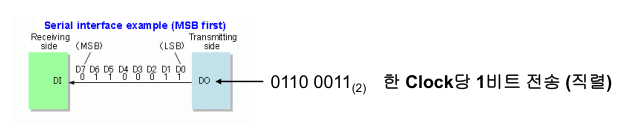
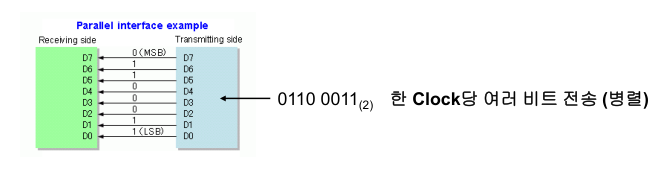
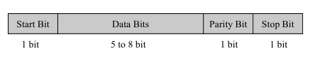
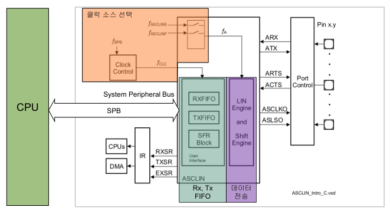
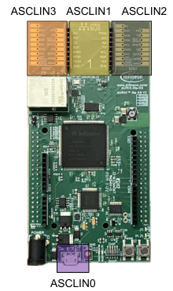
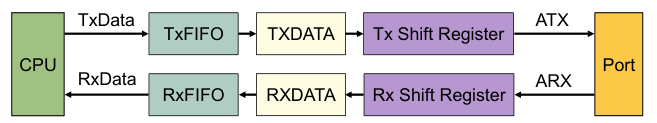

# 데이터 통신 기초

## 직렬(Serial) 통신

직렬 통신은 하나의 통신 선에서 한 번에 하나의 데이터 비트를 연속적으로 전송하는 방식이다. 하나의 선만 사용하므로 회로 구성이 간단하고, 비용이 적게 든다는 장점이 있다.

### 특징
- 데이터가 연속되어 전송되므로 각 비트를 구별할 방법이 필요함
  - 동기 방식: 클럭 신호를 함께 사용하여 전송
  - 비동기 방식: 시작/종료 비트를 사용하여 구분
- 장점: 저비용, 비교적 구현이 쉬움
- 단점: 동일 클럭에서 병렬 통신 대비 통신 속도가 느림

### 직렬 통신 예시
- UART, USART, I2C, Ethernet, CAN 등

### 데이터 흐름 예시

- 전송 데이터: `0110 0011₂`
- 전송 방식: 한 Clock당 1비트 전송 (MSB부터)




---

## 병렬(Parallel) 통신

병렬 통신은 여러 개의 통신 선에서 동시에 여러 개의 데이터 비트를 전송하는 방식이다. 각 비트를 위한 별도의 선을 사용하므로 속도는 빠르지만, 설계가 복잡하고 비용이 많이 든다.

### 특징
- 여러 개의 통신 선이 필요함
- 동일 클럭에서 직렬 통신보다 빠른 속도 제공
- 단점: 고비용, 구현이 어려움

### 병렬 통신 예시
- SCSI, PCI, IEEE-1284 등

### 데이터 흐름 예시

- 전송 데이터: `0110 0011₂`
- 전송 방식: 한 Clock당 여러 비트 전송 (8비트 병렬)



---


# 동기 전송 (Synchronous Transmission)

동기 전송은 송신자와 수신자가 **공통된 클럭 신호를 기준으로 타이밍을 맞추어 데이터를 주고받는 방식**이다.  
이 방식은 데이터 외에 추가로 **클럭 라인(SCK)**이 필요하며, 주로 SPI, I2C 같은 통신 프로토콜에서 사용된다.

## 특징
- **클럭 펄스**를 사용하여 송수신자 간 타이밍을 동기화
- 데이터 전송 전후로 제어 정보를 함께 삽입할 수 있음
- 데이터는 **클럭의 에지(Rising/Falling)**에 맞춰 전송되거나 수신됨
- **동기 통신 예시**: SPI, I2C, USART, JTAG

## 동작 방식 예시 (CPOL=0, CPHA=0 기준)
- 송신자는 클럭의 **하강 에지에서 비트를 전송**
- 수신자는 클럭의 **상승 에지에서 비트를 샘플링**

```
SCK  : ─┐_┌─┐_┌─┐_┌─┐_
DATA :    1   0   1   0
         ↑   ↑   ↑   ↑  (샘플링 타이밍)
```

---

## 동기 전송 예시: SPI

### SPI란?

SPI(Serial Peripheral Interface)는 **마스터-슬레이브 구조**의 동기식 직렬 통신 방식이다.  
**마스터가 클럭(SCK)을 제공**하고, 슬레이브는 해당 클럭에 맞춰 데이터를 송수신한다.

### 구성 신호

| 신호선 | 방향 | 설명 |
|--------|------|------|
| SCK    | M → S | 클럭 (타이밍 신호) |
| MOSI   | M → S | 마스터 → 슬레이브 데이터 |
| MISO   | S → M | 슬레이브 → 마스터 데이터 |
| SS/CS  | M → S | 슬레이브 선택 (Active Low) |

---

### SPI 통신 절차

1. **SCK 설정**:  
   - 마스터는 클럭의 속도(주파수), 극성(CPOL), 위상(CPHA)을 설정함

2. **SS 설정**:  
   - 원하는 슬레이브의 SS(또는 CS)를 Low로 내려서 슬레이브를 선택

3. **데이터 송수신**:  
   - 클럭의 변화(에지)에 따라 **MOSI → Slave**, **MISO → Master** 전송
   - 1클럭 주기당 1비트씩 송수신됨 (8비트 전송엔 8클럭 필요)

4. **SS 해제**:  
   - 통신이 끝나면 SS를 다시 High로 올려 연결 종료

---

### SPI 모드 (CPOL/CPHA 조합)

| 모드 | CPOL | CPHA | Idle 상태 | 샘플링 에지 |
|------|------|------|------------|----------------|
| 0    | 0    | 0    | Low        | 상승 에지      |
| 1    | 0    | 1    | Low        | 하강 에지      |
| 2    | 1    | 0    | High       | 하강 에지      |
| 3    | 1    | 1    | High       | 상승 에지      |

---

### SPI의 특징 요약

- **클럭 주기마다 1비트 전송**
- **Full-Duplex** 지원 (MOSI, MISO 동시 송수신)
- **동기 통신**이므로 반드시 마스터가 클럭 제공
- **하나의 마스터는 한 번에 하나의 슬레이브와만 통신 가능**

---

## 비동기 전송 (Asynchronous Transmission)

비동기 전송은 **공통된 클럭 신호 없이** 데이터를 주고받는 방식이다.  
대신에 **데이터 앞에 Start Bit, 뒤에 Stop Bit**을 붙여서 송수신 타이밍을 맞춘다.

### 특징
- **클럭 선이 없음** (데이터만 전송)
- 수신자는 **Start Bit을 감지**한 뒤, 내부 타이머를 이용해 나머지 비트를 수신
- 송수신 간 시간 간격(Idle)이 있어도 동작 가능

### 예시 프로토콜
- UART
- CAN

### 데이터 흐름 예시 (UART)

```
\[Idle] — \[Start Bit] — \[Data Bits] — \[Stop Bit]
1        0        8비트(예시)       1
```

- **Start Bit**: 항상 0
- **Stop Bit**: 항상 1
- 수신 장치는 Start Bit이 들어오면 내부 타이머를 작동시켜 Data Bit 타이밍을 계산함


---

## 비동기 전송 예시: CAN

CAN(Controller Area Network)은 차량용 통신에서 널리 쓰이는 **비동기 통신 프로토콜**이다.  
여러 노드가 하나의 버스를 공유하며, **프레임 단위로 데이터를 주고받는다**.

### 통신 절차
1. **CAN bus가 idle 상태**일 때, 송신 노드가 **프레임 전송 시작**
2. 수신 노드는 **SoF(Start of Frame)** 비트를 감지하면 수신 개시
3. 데이터 및 제어 필드 수신
4. **EoF(End of Frame)** 비트가 오면 수신 종료

### 프레임 구성 예시

| 필드             | 설명                             |
|------------------|----------------------------------|
| **SoF**          | 프레임 시작 비트 (Start of Frame) |
| **Arbitration**  | 송신 우선순위 판단용 ID 필드       |
| **Data Field**   | 실제 전송 데이터 (최대 8바이트)     |
| **CRC Field**    | 오류 검출용 체크섬                 |
| **ACK Field**    | 수신 확인 응답                    |
| **EoF**          | 프레임 종료 비트 (End of Frame)   |

- CAN 통신에서는 각 노드가 프레임의 시작/끝을 직접 감지하여 동작
- 비동기 방식이지만, **프레이밍 구조가 정교해서 신뢰성 높음**

---

## UART 개요

UART (Universal Asynchronous Receiver/Transmitter)는 **비동기 방식**으로 데이터를 주고받는 직렬 통신 방식이다.  
**클럭 신호 없이** Start Bit과 Stop Bit을 사용하여 통신하며, 다음 세 가지 전송 방식을 지원한다.

### 전송 방식
- **단방향(Simplex)**: 한쪽 방향으로만 데이터 전송
- **반이중(Half-Duplex)**: 양방향 통신 가능하지만 동시에 통신 불가 (번갈아가며 송수신)
- **양방향(Full-Duplex)**: 동시에 양방향 통신 가능

---

## UART 통신 프레임 구조

UART 통신은 **Start Bit → 데이터 비트 → (패리티 비트) → Stop Bit**의 구조로 전송된다.

### 각 구성 요소 설명

- **Start Bit**: 통신 시작을 알리는 신호 (항상 0)
- **Data Bits**: 전송할 실제 데이터 (보통 5~8비트)
- **Parity Bit (선택적)**: 오류 검출을 위한 비트
- **Stop Bit**: 통신 종료를 알리는 비트 (보통 1)




---

## 전송 속도

### 비트 레이트 (Bit Rate, bps)
- 1초당 전송되는 **비트 수**
- 예: 9600bps → 초당 9600비트 전송

### 보 레이트 (Baud Rate)
- 1초당 전송되는 **신호 변화(심볼)** 수
- UART는 1 심볼에 1비트를 담으므로 보 레이트 = 비트 레이트
- 송신측과 수신측은 반드시 같은 보 레이트를 설정해야 함

### 대표적인 UART 보 레이트 값
- 4800, 9600, 19200, 38400, 57600, 115200 등

---

## 비트 타이밍 오류

비동기 UART 통신에서 **송신측과 수신측의 통신 속도가 다를 경우** 다음과 같은 문제가 발생할 수 있다:

- **수신측 속도가 더 빠른 경우**:  
  → 수신자가 잘못된 타이밍에 샘플링하여 다른 값으로 인식함

- **수신측 속도가 더 느린 경우**:  
  → 수신 시점이 어긋나면서 비트를 잘못 읽거나 누락

### 해결 방법
- 송수신 장치 모두 **정확히 같은 보 레이트**로 설정되어야 함

---

## 패리티 비트 (Parity Bit)

패리티 비트는 **데이터 전송 중 오류를 검출**하기 위해 사용하는 간단한 에러 검출 방식이다.  
전송되는 데이터에 **1비트의 검사용 비트(패리티 비트)**를 추가하여, 수신 측에서 데이터가 제대로 도착했는지 확인할 수 있다.

---

### 사용 방식

- 송신 측: 데이터 전송 시 **패리티 비트를 포함**하여 전송
- 수신 측: 받은 데이터의 **1의 개수**를 세어, 전송된 패리티 조건과 일치하는지 확인

---

### 패리티 방식의 종류

#### ▸ 짝수 패리티 (Even Parity)
- **전체 1의 개수가 짝수**가 되도록 패리티 비트를 설정
- 예: 데이터 1010001 → 1이 3개 → 패리티 비트 = 1 → 총합 4개(짝수)

#### ▸ 홀수 패리티 (Odd Parity)
- **전체 1의 개수가 홀수**가 되도록 패리티 비트를 설정
- 예: 데이터 1010001 → 1이 3개 → 패리티 비트 = 0 → 총합 3개(홀수 유지)

---

### 예시: 짝수 패리티 오류 검출

수신 측에서 아래와 같은 데이터를 받았다고 가정:

```
1 1 1 0 0 0 1 0 ← 패리티 포함 (짝수 패리티)
```

- 1의 개수: 5 → **짝수가 아님**
- 따라서 **전송 중 1비트 오류 발생**을 확인할 수 있음

---

### 패리티 비트의 한계

- **모든 오류를 검출할 수는 없음**
  - 예: 2비트가 동시에 바뀌면, **1의 개수는 유지되므로 오류를 검출할 수 없음**
- **오류 위치를 알 수 없음**
- **오류 복구 불가**
  - 단순히 “오류가 발생했다”는 것만 판단 가능

---

## ASCLIN 모듈 소개

ASCLIN (Async/Synchronous Interface)은 Infineon사의 TC 시리즈 MCU에 탑재된 **통신 인터페이스 모듈**이다.  
이 모듈은 **비동기(UART)**, **동기(SPI)**, **LIN 통신**을 모두 지원하며, 유연한 통신 구성이 가능하다.

### 주요 특징

- **비동기 / 동기 통신 지원**
- **UART, LIN, SPI** 통신 지원
- 최대 **16-byte TxFIFO / RxFIFO** 제공
- **16-bit oversampling** 지원
- **양방향 비동기 통신 지원**
- 표준 및 확장 비동기 전송 지원
- **루프백 모드** 지원 (자기 자신에게 송신)
- **TC375에는 총 12개의 ASCLIN 모듈**이 탑재됨

### ASCLIN 블록 다이어그램



### 보드 ASCLIN 핀 구성



---

## 클럭 및 크리스탈 이해


### 클럭(Clock)

클럭은 **디지털 회로가 작동하기 위한 기본적인 기준 신호**다.  
MCU, CPU, 주변 장치 등 모든 디지털 시스템은 **정해진 타이밍에 맞춰 동작**하기 때문에 클럭이 필수다.

- 디지털 회로는 클럭의 상승/하강 에지를 기준으로 동작함
- 클럭은 0과 1로 이루어진 **사각파 형태**로 동작 타이밍을 제공함
- 클럭이 없으면 회로는 언제 연산하거나 송수신해야 할지 알 수 없음

---

### 크리스탈(Crystal Oscillator)

크리스탈은 **MCU에 클럭을 공급하기 위한 부품**이다.  
일반적으로 **정현파(sin wave)**를 발생시키며, 이를 **MCU 내부 회로가 사각파로 변환**하여 사용한다.

- MCU는 크리스탈로부터 전달받은 **정현파를 이산화**하여 사각파 신호로 사용
- 이 사각파를 **클럭 소스로 사용**하여 명령어를 수행하거나 통신을 제어함
- MCU는 이 클럭을 이용해 **내부 연산 뿐만 아니라 주변기기(peripheral)** 동작도 타이밍에 맞게 수행함

---

좋아, 이번에는 네가 올려준 3개의 슬라이드에 대해 마크다운 문서 형식으로 **ASCLIN 클럭 소스와 송수신 FIFO 구조**를 정리해줄게:

---

## ASCLIN 클럭 소스 선택

ASCLIN 모듈은 통신 속도를 설정하기 위해 내부적으로 다양한 **클럭 소스(fA)**를 선택하여 사용한다.  
LIN Engine 및 Shift Engine은 이 클럭을 기반으로 동작하며, 통신 타이밍을 제어한다.

- Shift Engine : Port를 통해 실제 데이터 전송 담당
- LIN Engine : LIN 통신을 사용할 경우 데이터 전송 담당
---

### LIN Engine & Shift Engine의 클럭 구성

- **클럭 소스: fA**
  - 선택 기준: `CSR.CLKSEL` 레지스터 값에 따라 결정
  - fA = f<sub>ASCLINSRC</sub> / ASCLINS 또는 f<sub>SOURCE</sub> / ASCLINF

- **주요 경로**
  - PLL → CCUCONx.CLKSEL 설정 → ASCLIN에 클럭 공급
  - 클럭은 내부 BUS, OSC, EVR 등 다양한 소스에서 올 수 있음

---

## 송수신 FIFO 클럭

### FIFO 클럭 소스: f<sub>CLC</sub>
- FIFO는 **System Peripheral Bus(SPB)**와 동일한 클럭을 사용함
- 보통 **f<sub>SPB</sub> = 100MHz**로 설정됨

---

## ASCLIN 송수신 FIFO

### FIFO란?

FIFO(First-In First-Out)는 데이터를 **입력 순서대로 출력**하는 버퍼 구조다.  
ASCLIN 모듈 내부에서는 **RXFIFO(수신)와 TXFIFO(송신)**로 나누어 동작한다.

---

### 주요 역할

- **MCU 내부 버스**와 **외부 송수신 데이터**를 연결하는 인터페이스 역할
- 데이터를 버퍼링하여 MCU와 하드웨어 간 동작 타이밍 차이를 완충

---

### 데이터 크기 설정

- FIFO는 들어오고 나가는 데이터의 크기를 다음 중 하나로 설정 가능:
  - `8-bit`
  - `16-bit`
  - `32-bit`

→ FIFO 크기나 형식은 ASCLIN 레지스터 설정을 통해 제어됨

---

## 주변 모듈과 연동

ASCLIN 모듈은 외부 핀을 통해 데이터를 주고받기 때문에, 사용자는 **해당 핀의 입출력 설정**을 명확히 해야 한다.

---

### 외부 입출력 포트 설정

- **입력 핀 예시**: `P14.1`
  - `ASCLIN0_ARXA`: Receive input으로 사용됨
- **출력 핀 예시**: `P14.0`
  - `ASCLIN0_ATX`: Transmit output으로 사용됨

> 사용되는 포트는 동작 모드(UART, LIN 등)에 따라 변경될 수 있으며, 레지스터에서 설정 가능

---

### 지원 인터럽트 종류

- **Rx 인터럽트**: 데이터 수신 시 발생
- **Tx 인터럽트**: 데이터 송신 완료 시 발생
- **Ex 인터럽트**: Extended Error (오류 상태) 발생 시 사용됨

---

## ASCLIN Data Transfer Path

ASCLIN 모듈은 **TxFIFO, RxFIFO**라는 두 개의 FIFO를 통해 내부 데이터와 외부 포트를 연결한다.

---

### FIFO 구성

- **TxFIFO**: MCU에서 외부로 데이터를 **전송**하고자 할 때 사용
- **RxFIFO**: 외부에서 들어오는 데이터를 **수신**하고자 할 때 사용
- 둘 다 **최대 16Byte**까지 저장 가능

---

### 데이터 흐름

1. **CPU → TxFIFO** → `TXDATA` → `Tx Shift Register` → **ATX 핀** → 외부 포트
2. 외부 포트 → **ARX 핀** → `Rx Shift Register` → `RXDATA` → **RxFIFO → CPU**

- **TXDATA / RXDATA**: 송수신용 데이터 버퍼 레지스터
- **Shift Register**: 실제로 직렬 전송을 수행하는 회로
  - 내부 데이터를 외부 핀으로 직렬화(Serializing)하여 전송하거나
  - 외부에서 직렬 수신한 데이터를 병렬화(Deserializing)하여 저장



---

## ASCLIN Control Register

---

### 1. CLC (Clock Control Register)

- **설명**: ASCLIN 모듈의 활성/비활성 제어를 담당하는 레지스터
- **DISR[0] - Module Disable Request Bit**
  - `1`: 모듈 비활성화
  - `0`: 모듈 활성화
- **EDIS - Sleep Module Enable Control**
  - `0`: Sleep 모드 허용
  - `1`: Sleep 비허용 (항상 동작)

---

### 2. IOCR (Input and Output Control Register)

- **설명**: ASCLIN의 RX, TX 신호 관련 설정
- **TX 출력 설정**: Port 모듈의 IOCR 레지스터에서 설정
- **RX 입력 설정**: `ALTI[2:0]` 필드를 통해 선택

#### ALTI[2:0] - Alternate Input Select
| 값 (Binary) | 선택 입력 |
|-------------|-----------|
| 000         | Alternate Input A |
| 001         | Alternate Input B |
| ...         | ...               |
| 111         | Alternate Input H |

---

### 3. BITCON (Bit Configuration Register)

- **설명**: 통신 속도(Baudrate) 설정 레지스터

#### 필드 설명
- **SM[31]**: 비트당 샘플 개수 (`0`: 1, `1`: 3)
- **SAMPLEPOINT[27:24]**: 샘플 위치 설정 (0 ~ 15)
- **OVERSAMPLING[19:16]**: 오버샘플링 설정 (1 ~ 16)
- **PRESCALER[11:0]**: 클럭 분주기 설정 (0 ~ 4095)

---

### 4. BRG (Baud Rate Generation Register)

- **설명**: Baudrate 계산을 위한 분자/분모 설정

#### 필드 설명
- **NUMERATOR[27:16]**: 분자 설정 (0 ~ 4095)
- **DENOMINATOR[11:0]**: 분모 설정 (0 ~ 4095)

---

### 5. TXFIFOCON (TX FIFO Configuration Register)

- **설명**: 송신 FIFO 설정 레지스터

#### 필드 설명
- **INW[7:6]**: 송신 FIFO 입력 폭
  - `00`: 0 byte
  - `01`: 1 byte
  - `10`: 2 bytes
  - `11`: 4 bytes
- **ENO[1]**: FIFO 출력 허용
  - `0`: 비활성화
  - `1`: 활성화
- **FLUSH[0]**: FIFO 비우기
  - `0`: No effect
  - `1`: FIFO 초기화

---

### 6. RXFIFOCON (RX FIFO Configuration Register)

- **설명**: 수신 FIFO 설정 레지스터

#### 필드 설명
- **BUF[31]**: 수신 버퍼 모드
  - `0`: FIFO 모드
  - `1`: 32-bit 단일 스테이지 RX 버퍼 (새 데이터로 덮어쓰기)
- **OUTW[7:6]**: 출력 폭 설정
  - `00`: 0 byte
  - `01`: 1 byte
  - `10`: 2 bytes
  - `11`: 4 bytes
- **ENI[1]**: FIFO 입력 허용
  - `0`: 비활성화
  - `1`: 활성화
- **FLUSH[0]**: FIFO 초기화
  - `0`: No effect
  - `1`: 수신 FIFO 비움

---

## UART 통신 실습 정리 (TC375 + ASCLIN 모듈)

### 실습 개요

* **목적**: TC375 보드의 ASCLIN0 모듈을 활용한 UART 통신 초기화 및 송수신 동작 실습
* **내용**:

  * UART 통신의 기본 구조 이해
  * ASCLIN 모듈 설정 및 FIFO 구성
  * Polling 방식의 UART 송수신 구현
  * UART 기반 LED 제어 및 입출력 테스트

## 하드웨어 설정

* **핀 설정**

  * `P14.0`: TX 출력 (Output 설정)
  * `P14.1`: RX 입력 (Alternate Input A 설정)

```c
// TX 핀 출력 설정
MODULE_P14.IOCR0.B.PC0 = 0x12;
MODULE_P14.OUT.B.P0 = 1;

// RX 핀 입력 설정
MODULE_ASCLIN0.IOCR.B.ALTI = 0; // Alternate Input A
```

## 소프트웨어 설정

* **ASCLIN 모듈 활성화**

```c
IfxScuWdt_clearCpuEndinit(IfxScuWdt_getGlobalEndinitPassword());
MODULE_ASCLIN0.CLC.U = 0;
IfxScuWdt_setCpuEndinit(IfxScuWdt_getGlobalEndinitPassword());
(void)MODULE_ASCLIN0.CLC.U; // Read back
```

* **FIFO 설정 (TX/RX)**

```c
MODULE_ASCLIN0.TXFIFOCON.U = (1 << 6) | (1 << 1) | (1 << 0);
MODULE_ASCLIN0.RXFIFOCON.U = (1 << 31) | (1 << 6) | (1 << 1) | (1 << 0);
```

* **통신 속도 설정 (Baud Rate = 115200)**

```c
unsigned int numerator = 576;
unsigned int denominator = 3125;

MODULE_ASCLIN0.BITCON.U = (9 << 0) | (15 << 16) | (9 << 24) | (1u << 31);
MODULE_ASCLIN0.BRG.U = (denominator << 0) | (numerator << 16);
```

* **Frame 설정 (8N1, No Parity)**

```c
MODULE_ASCLIN0.FRAMECON.U = (1 << 9) | (0 << 16) | (0 << 30);
MODULE_ASCLIN0.DATCON.U = (7 << 0);
MODULE_ASCLIN0.FRAMECON.B.MODE = 1; // ASC mode
```

## UART 통신 예제 코드

* **문자 송신**

```c
void Asclin0_OutUart(const unsigned char chr) {
    while (!(MODULE_ASCLIN0.FLAGS.B.TFL != 0));
    MODULE_ASCLIN0.FLAGSCLEAR.U = (1u << 28); // TFLC
    MODULE_ASCLIN0.TXDATA.U = chr;
}
```

* **문자 수신 (Polling 방식)**

```c
int Asclin0_PollUart(unsigned char *chr) {
    if (MODULE_ASCLIN0.FLAGS.B.RFL != 0) {
        unsigned char ret = (unsigned char)MODULE_ASCLIN0.RXDATA.U;
        MODULE_ASCLIN0.FLAGSCLEAR.U = (1u << 28); // RFLC

        if (MODULE_ASCLIN0.FLAGS.U & ((1u << 8) | (1u << 9) | (1u << 10))) {
            MODULE_ASCLIN0.FLAGSCLEAR.U = (1u << 24) | (1u << 25) | (1u << 26);
        } else {
            *chr = ret;
            return 1;
        }
    }
    return 0;
}
```

## 실습 1: UART Echo

```c
int main(void) {
    unsigned char c;
    SYSTEM_Init();
    while(1) {
        c = Asclin0_InUart();
        Asclin0_OutUart(c);
        if (c == '\r') Asclin0_OutUart('\n');
    }
}
```

## 실습 2: '0', '1' 입력 처리

```c
int main(void) {
    unsigned char c;
    SYSTEM_Init();
    while(1) {
        c = Asclin0_InUart();
        if (c == '0') my_printf("Input : 0\n");
        else if (c == '1') my_printf("Input : 1\n");
        else my_printf("Other Input\n");
    }
}
```

## 실습 3: UART로 LED 제어

```c
int main(void) {
    unsigned char c;
    SYSTEM_Init();
    while(1) {
        c = Asclin0_InUart();
        if (c == '1') {
            GPIO_SetLed(1, 1);
            my_printf("LED ON!\n");
        } else if (c == '0') {
            GPIO_SetLed(1, 0);
            my_printf("LED OFF!\n");
        }
    }
}
```

## 실습 4: 논블로킹 방식 LED 상태 지속 출력

```c
int main(void) {
    char c;
    int isLed1On = 0;
    SYSTEM_Init();
    while(1) {
        c = Asclin0_InUartNonBlock();
        if (c == '1') {
            GPIO_SetLed(1, 1);
            isLed1On = 1;
        } else if (c == '0') {
            GPIO_SetLed(1, 0);
            isLed1On = 0;
        }
        my_printf(isLed1On ? "LED ON!\n" : "LED OFF!\n");
    }
}
```

---