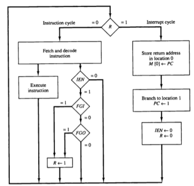
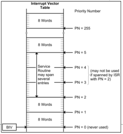
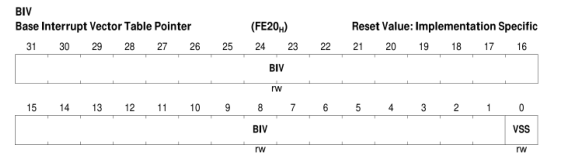
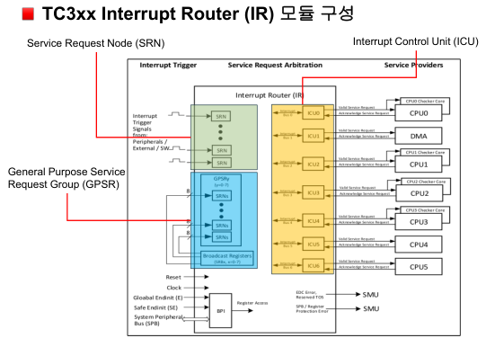
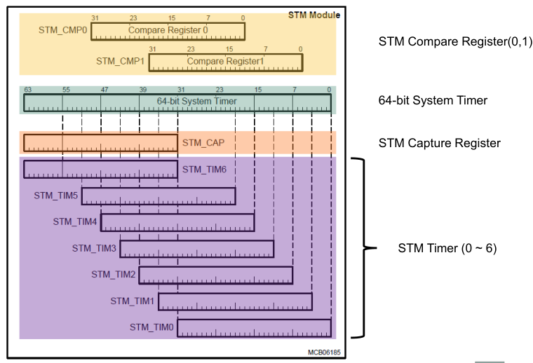

# 인터럽트 및 타이머 모듈 실습

## 인터럽트 방식의 등장 배경

- 기존 Polling 방식에서는 CPU가 주기적으로 입출력 장치의 상태를 확인함  
- CPU는 매우 빠르지만 I/O 장치는 느려서, 대부분의 확인이 낭비로 끝남  
- 예:  
  - CPU는 1us마다 상태 확인  
  - 입출력 장치는 1000us마다 이벤트 발생  
  - 결과적으로 CPU는 1000번 중 999번은 의미 없는 확인을 수행

## 인터럽트 방식의 특징

- 하드웨어가 입출력 이벤트 발생 시 직접 CPU에 인터럽트 신호를 보냄  
- CPU는 다음 명령어 사이클 시작 시 인터럽트 플래그(R)를 체크  
- 인터럽트 발생 시 ISR(Interrupt Service Routine)으로 분기하여 처리  
- Polling보다 CPU 자원 낭비가 적고 실시간 반응이 가능

## 인터럽트 사이클 동작 구조

- 명령 사이클 도중 인터럽트 이벤트 발생 여부(R 플래그)를 확인  
- IEN = 1 (인터럽트 허용 상태)이고 R = 1이면 인터럽트 사이클로 진입  
- 인터럽트 사이클에서는 다음 순서가 실행됨:  
  - 현재 PC 값을 주소 0에 저장  
  - PC 값을 주소 1로 설정  
  - IEN, R 비트를 초기화  
  - 인터럽트 서비스 루틴 실행

### 관련 플래그

| 플래그 | 설명                            |
|--------|---------------------------------|
| R      | 인터럽트 요청 플래그(Request)   |
| IEN    | 인터럽트 허용 플래그(Interrupt Enable) |

## 인터럽트 사이클 흐름도



## 인터럽트 사이클 실행 과정 요약

- **Store Return Address in loc. at 0**  
  현재 PC 값을 메모리 0번지에 저장

- **Branch to loc. at 1**  
  PC 값을 1번지로 설정 (인터럽트 벡터 시작 위치)

- **Interrupt info. clear**  
  IEN ← 0, R ← 0으로 인터럽트 관련 플래그 초기화

- **Interrupt Vector Table 참조**  
  ISR(Interrupt Service Routine)의 주소가 저장된 테이블  
  CPU는 해당 벡터를 통해 ISR로 분기  
  (CPU 아키텍처마다 벡터 테이블의 위치/구조는 다름)

---

## TriCore 인터럽트 시스템 구성

### Interrupt Request Sources
- 인터럽트를 발생시키는 주체
- 각 인터럽트는 **인터럽트 요청 우선순위 (SRPN)** 을 가짐
- 예시: 주변장치(Peripherals), 외부 인터럽트(External Interrupt) 등

### Interrupt Service Provider (ISP)
- 다양한 인터럽트 요청에 대한 처리를 수행
- 인터럽트 요청이 발생하면 **인터럽트 서비스 루틴 (ISR)** 을 호출
- 예시: CPU 또는 DMA 채널이 ISR을 수행함

### Interrupt Control Unit (ICU)
- 인터럽트가 발생하면 어떤 서비스 제공자에게 인터럽트를 전달할지 제어하는 역할
- 동시에 여러 인터럽트 요청이 발생하면, 더 높은 우선순위를 가진 인터럽트를 **ISPI**에 전달

## Interrupt Vector Table

### 개요
- ISR(Interrupt Service Routine)의 진입 주소가 저장된 테이블
- 인터럽트가 발생하면 해당 인터럽트 ISR의 진입 주소를 계산하여 프로그램 카운터(PC)로 로드
- 메모리에 저장되며, 항목은 2워드 또는 8워드 단위로 구성됨

### 구성
- BIV(Base Interrupt Vector Table Pointer) 레지스터를 통해 설정
- BIV[31:1]: 벡터 테이블의 base 주소 저장
- VSS[0]: 각 항목의 크기를 설정
  - `0`: 32 Bytes
  - `1`: 8 Bytes






---

## 인터럽트 수행 과정

1. 인터럽트 활성화 여부 확인  
   - 조건: `ICR.IE == 1`

2. 현재 인터럽트 우선순위와 pending 인터럽트 우선순위 비교  
   - `ICR.CCPN > ICR.PIPN`: 우선순위 낮음 → 업데이트 안함  
   - `ICR.CCPN < ICR.PIPN`: 우선순위 높음 → ICR.CCPN 값을 PIPN 값으로 갱신

3. ICR.CCPN에 해당하는 벡터 테이블의 ISR 진입 주소를 프로그램 카운터(PC)에 설정

4. ISR 진입  
   - ISR 수행 중 `ICR.IE`가 비활성화되어 인터럽트 중첩 수신 불가

5. ISR 종료 후 원래 코드 실행 복귀  
   - `ICR.IE`가 재활성화되어 인터럽트 수신 가능 상태로 전환

# 인터럽트 모듈 소개


## TC375 인터럽트 라우터

### 서비스 요청 노드 (SRN)

인터럽트 요청을 관리하고 처리하는 단위로, 각 SRN은 SRC 레지스터를 포함하고 있음.

#### Service Request Control (SRC)
- 인터럽트 요청의 우선순위 설정
- 인터럽트 라우팅 정보 저장

#### Interface Logic
- SRN은 외부 트리거나 유닛으로부터의 요청을 인터럽트 라우터로 전달
- 인터럽트 요청을 내부 인터럽트 중재(arbitration) 버스로 연결
- 인터럽트 라우터 모듈은 해당 요청을 해당 인터럽트 제어 유닛(ICU)로 전달

---

### 범용 서비스 요청 (GPSR)

- TC375에서는 병렬로 서비스 요청을 트리거할 수 있는 GPSR 기능 제공
- 3개의 GPSR 그룹이 있으며, 각 그룹은 8개의 SRN으로 구성
- `INT_SRBxy` 레지스터를 통해 서비스 제공자에게 서비스 요청 가능
  - x: 그룹 번호 (0~2)
  - y: 그룹 내 SRN 번호 (0~7)


### 인터럽트 제어 유닛 (ICU)

#### ICU의 주요 역할
- 인터럽트 중재 및 전달
- 서비스 요청 정보 수신, ECC 체크
- 처리된 서비스 요청을 클리어

#### 구조
- 각 ICU는 하나의 서비스 제공자(CPU, DMA 등)와 연결됨
- 각 SRN은 `SRCx.TOS` 레지스터를 통해 특정 ICU에 매핑됨

---

# ERU (External Request Unit) 개요

**ERU는 다양한 입력 이벤트를 기반으로 인터럽트를 생성할 수 있는 장치**로, 외부 신호 감지 및 처리에 활용됨.

## ERU의 주요 기능

### 1. **다목적 이벤트 및 패턴 감지 장치**

* 다양한 입력에서 선택 가능한 트리거 이벤트를 기반으로 인터럽트 생성

---

# ERU의 세 가지 주요 구성

## 1. **독립적인 8개의 입력 채널**

* 각 입력 채널에 트리거나 게이트 기능을 설정 가능
* 입력 선택 및 조건 정의 수행

## 2. **이벤트 분배 (Event Routing)**

* **Connecting Matrix**를 통해 입력 채널 X의 이벤트를 출력 채널 Y에 연결
* 입력에 따른 출력 연결 설정 가능

## 3. **독립적인 8개의 출력 채널**

* 이벤트 조합, 인터럽트 발생 효과 정의
* 이벤트를 시스템으로 분배하거나 인터럽트를 발생시키기 위한 경로

## ERU 블록 다이어그램


- OGU에서 입력을 받고 SRN으로 넘긴다.

---

# 타이머 이해

## 타이머 (Timer)

* MCU에서 단위 시간에 따라 task를 호출하는 기능
* MCU에서 1ms를 측정하려면 어떻게 해야 하는가?
  예) 1ms, 2ms, 5ms, 10ms, 20ms 등…
* 타이머를 이용하여 Real Time OS의 주기 Task 스케줄 구현 가능

---

# 카운터 & 타이머 기본 동작 원리

## 카운터 동작 원리

* 입력 클럭 신호의 주파수에 따라 16bit 카운터가 1씩 증가 (업카운트)
* 카운터는 1클럭 펄스마다 1씩 증가
* 입력 클럭이 1MHz일 경우:

  * 각 클럭 주기는 `1us`
  * 즉, 카운터 1은 `1us`를 뜻함
* 최대 카운트 값: `2^16 = 65536 → 0~65535`

## 타이머 동작 원리

* 카운터 overflow가 발생하거나 특정 count를 넘어서면 인터럽트가 발생하여 task를 호출함


# STM(System Timer) 레지스터 



## 1. 64-bit System Timer 개요

- STM 타이머는 64비트 타이머로 구성됨.
- Reset 이후 자동으로 타이머 값이 증가.
- TC375에서 64비트 타이머 값을 **한 번에 읽으려면** 2개의 명령어 사이클이 소요됨.
- 두 개의 명령어를 실행하는 동안 **타이머 값이 변경될 수 있음**.
- 따라서 한 번에 읽을 수 있는 값은 최대 32비트.

---

## 2. STM_CAP 레지스터

- 64비트 전체 값을 **정확하게 읽기 위해 사용하는 레지스터**.
- 항상 System Timer의 **상위 32비트 값**을 STM_CAP에 복사해 놓음.
- STM_CAP → 상위 32비트, TIM 레지스터 → 하위 32비트
- 이를 이용하면 64비트를 안정적으로 읽을 수 있음.

---

## 3. STM_TIM 레지스터 (0 ~ 6)

- 32비트 크기를 가지며, System Timer의 특정 비트 구간을 읽는 레지스터.
- 예시:
  - **STM_TIM0**: 0 ~ 31번 비트 읽음 (하위 32비트)
  - **STM_TIM2**: 8 ~ 35번 비트 읽음 (중간 비트)
- TIM0부터 TIM6까지 각각 타이머의 일정 비트 범위를 읽을 수 있도록 구성됨.

---

## 4. 타이머 값 읽기 예시 (64비트 읽기 절차)

1. STM_CAP 레지스터를 읽어 상위 32비트 저장
2. STM_TIM0 레지스터를 읽어 하위 32비트 저장
3. 두 값 조합 → 64비트 현재 타이머 값

주의: STM_TIM0 읽기 전에 STM_CAP을 먼저 읽어야 일관성 있는 64비트 타이머 값 확보 가능

---

# STM1 Compare Interrupt 실습 정리

## 개요

이번 실습에서는 **STM(System Timer Module)** 의 Compare 기능을 활용하여
**STM1에서 주기적으로 인터럽트를 발생**시키는 프로그램을 구성하였다.
핵심은 CMP\[0] 비교기가 타이머 값과 일치했을 때 인터럽트가 발생하도록 설정하는 것이다.

---

## 1. 인터럽트 설정 흐름 요약

| 단계                    | 설명                                         |
| --------------------- | ------------------------------------------ |
| ① Compare 크기/시작 비트 설정 | `MSIZE0 = 31`, `MSTART0 = 0` → 32bit 비교 사용 |
| ② 인터럽트 라우팅 설정 (SRC)   | `TOS`, `SRPN`, `SRE`, `CLRR` 설정            |
| ③ 인터럽트 요청 상태 클리어      | `CMP0IRR = 1U`                             |
| ④ 인터럽트 허용             | `CMP0EN = 1U`                              |
| ⑤ Compare 타이밍 설정      | `CMP[0] = (getTimeUs() + 1000000) * 100`   |
| ⑥ ISR 정의              | Compare 발생 시 메시지 출력 및 다음 CMP 설정            |

---

## 2. 코드 및 주요 레지스터 설명

### CMP 비교값 설정

```c
MODULE_STM1.CMP[0].U = (unsigned int)(getTimeUs() + 1000000) * 100;
```

* `getTimeUs()` → 현재 시간을 **마이크로초(us)** 로 반환하는 함수
* `+ 1000000` → 지금으로부터 **1초 뒤를 목표 시점**으로 설정
* `* 100` → STM은 **100MHz 클럭** → `1us = 100 STM Tick`
  → 즉, **100,000,000 Tick = 1초**가 된다.

> 만약 `* 100`을 생략하면 시간 단위가 맞지 않아 비교가 제대로 동작하지 않는다.

---

### ICR vs ISCR

| 레지스터   | 설명                                                                                 |
| ------ | ---------------------------------------------------------------------------------- |
| `ICR`  | **Interrupt Control Register**. 인터럽트를 **활성화하거나 출력 선택**을 제어함. (`CMP0EN`, `CMP0OS`)  |
| `ISCR` | **Interrupt Status Clear Register**. **인터럽트 요청 상태(CMPxIR)를 클리어**하는 용도. (`CMP0IRR`) |

> 즉, **ICR은 인터럽트를 발생할 수 있게 해주는 설정**,
> **ISCR은 인터럽트가 발생한 후 상태를 초기화**하는 역할이다.

---

### CMP0IRR 클리어의 필요성

```c
MODULE_STM1.ISCR.B.CMP0IRR = 1U;
```

* 인터럽트 요청 비트인 `CMP0IR`을 **클리어(초기화)** 하기 위한 명령
* 이 비트를 클리어하지 않으면 **다음 인터럽트가 발생하지 않음**
* 일반적으로 ISR 내부에서 클리어를 수행하지만,
  이번 실습에서는 외부에서 한 번만 클리어해도 반복 동작이 가능함
  (→ CMP\[0] 값이 매번 새롭게 설정되므로 하드웨어가 자동 set 처리)

---

### CMP0과 SR[0]의 관계

```c
MODULE_SRC.STM.STM[1].SR[0]
```

* 여기서 `SR[0]`은 **STM1의 CMP\[0] 비교기에 대한 인터럽트 제어 레지스터**
* 만약 `CMP[1]`을 사용한다면 `SR[1]`을 설정해야 한다.

---

## 3. 인터럽트 서비스 루틴 (ISR)

```c
IFX_INTERRUPT(Stm1IsrHandler, 0, ISR_PRIORITY_STM0);
void Stm1IsrHandler(void)
{
    MODULE_STM1.CMP[0].U = (unsigned int)(getTimeUs() + 1000000) * 100;
    my_printf("STM!\n");
}
```

* 인터럽트 발생 시 실행되는 함수
* `CMP[0]` 값을 다시 1초 뒤로 설정하여 **주기적으로 인터럽트 재발생**
* `CMP0IRR = 1` 클리어는 외부에서 한 번만 수행됨

---

## 4. Q&A

| 질문                           | 요약 답변                                              |
| ---------------------------- | -------------------------------------------------- |
| 왜 `* 100`을 하죠?               | STM은 클럭이 100MHz이므로, 1us = 100 Tick으로 환산            |
| `ISCR`과 `ICR` 차이?            | ICR은 인터럽트 발생 허용, ISCR은 인터럽트 요청 상태 클리어              |
| `CMP0IRR`을 ISR에서 안 해도 되는 이유? | CMP 값을 매번 갱신하기 때문에 새 이벤트가 발생하고, 자동 인터럽트 요청 재활성화 가능 |
| `SR[0]`을 쓰는 이유?              | CMP\[0]에 해당하는 인터럽트 제어 레지스터이기 때문                    |

---

# GPT 타이머를 활용한 부저(Buzzer) 동작 실습

## 1. 부저 회로 구성

* 부저(Buzzer)는 D5 핀(P2.3)에 연결되어 있으며, 트랜지스터를 통해 충분한 전류가 흐를 수 있도록 설계됨.
* D5 핀을 High로 설정하면 트랜지스터를 통해 부저가 울림.

```c
MODULE_P02.IOCR0.B.PC3 = 0x10; // P2.3을 출력으로 설정
```

---

## 2. 타이머 기반 PWM 방식 부저 제어 개요

* 수동 부저는 주어진 주파수에 따라 on/off를 반복하여 음을 냄.
* PWM 신호를 타이머 인터럽트를 통해 자동 생성함.
* 사용된 GPT1 타이머 구성:

  * **T3 (Core Timer)**: PWM 신호를 주기적으로 토글
  * **T2 (Auxiliary Timer)**: Reload 타이머 (T3의 값을 재설정)

---

## 3. GPT1 타이머 설정

### 3.1 주파수 계산

예: 130 Hz → 1 사이클 = 7692 us → 1/2 사이클 = 3846 us
Tick 시간 = 10.24 us → `3846 / 10.24 ≈ 375 tick`

### 3.2 타이머 초기화 코드 예시 (130Hz 부저)

```c
void gpt1_init(void)
{
    MODULE_GPT120.T3CON.B.BPS1 = 0x2; // GPT1 block prescaler: 32
    MODULE_GPT120.T3CON.B.T3M = 0x0;  // Timer mode
    MODULE_GPT120.T3CON.B.T3UD = 0x1; // Down count
    MODULE_GPT120.T3CON.B.T3I = 0x5;  // Prescaler: 2^5 = 32
    MODULE_GPT120.T3.U = 375;         // T3 초기값 (Up/Down 주기)
    
    MODULE_GPT120.T2CON.B.T2M = 0x4;  // T2: Reload Mode
    MODULE_GPT120.T2CON.B.T2I = 0x7;  // Reload Input Mode: T3OTL Rising/Falling
    MODULE_GPT120.T2.U = 375;         // T2: Reload 값

    // 인터럽트 등록
    volatile Ifx_SRC_SRCR *src;
    src = (volatile Ifx_SRC_SRCR*) (&MODULE_SRC.GPT12.GPT12[0].T3);
    src->B.SRPN = ISR_PRIORITY_GPT1T3_TIMER;
    src->B.TOS = 0;
    src->B.CLRR = 1;
    src->B.SRE = 1;

    runGpt12_T3(); // T3 시작
}
```

---

## 4. 부저 인터럽트 핸들러

```c
IFX_INTERRUPT(IsrGpt1T3Handler_Beep, 0, ISR_PRIORITY_GPT1T3_TIMER);
void IsrGpt1T3Handler_Beep(void)
{
    MODULE_P02.OUT.B.P3 ^= 1; // P2.3 핀 토글 → 부저 on/off
}
```

---

## 5. 주파수 변경 예시 (5옥타브 도, 523Hz)

* 1사이클 = 1 / 523 ≈ 1911us → 1/2사이클 = 956us
* Tick 시간 10.24us → `956 / 10.24 ≈ 93 tick`

```c
MODULE_GPT120.T3.U = 93;
MODULE_GPT120.T2.U = 93;
```

---

## 6. 동작 예시 (main 함수)

```c
void main(void)
{
    SYSTEM_Init();
    gpt1_init();

    while (1) {
        // 타이머 인터럽트가 자동으로 부저 동작을 처리함
    }
}
```

---

## 7. 동작 원리 요약

* T3 타이머가 다운카운트 하다가 underflow 발생
* Toggle Latch를 통해 T2가 동작 → T3의 값 reload
* 인터럽트가 발생하여 부저 핀(P2.3)이 토글됨
* 반복적인 토글을 통해 PWM 신호를 생성하여 부저를 울림

---