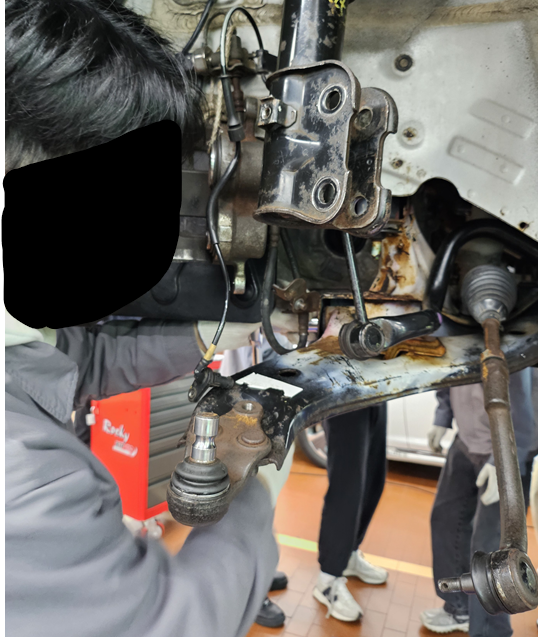

# 자동차 구조 실습

---

## 실습 개요

- **실습 기간**: 2025년 5월 7일 ~ 2025년 5월 9일 (총 3일간)  
- **실습 장소**: 경기과학기술대학교 자동차실습관  
- **실습 목적**:  
  - 자동차의 주요 부품과 구조에 대한 이해  
  - 부품 분해 및 조립을 통한 작동 원리 학습  
  - 자동차 안전장치에 대한 실무적인 이해 

---

## 1일차 - 엔진 및 전장 부품 실습

### 학습 내용

* **자동차 엔진 학습**

  * 엔진 주요 구성 요소: 실린더 블록, 피스톤, 크랭크샤프트, 캠샤프트, 타이밍 벨트(체인), 밸브, 점화 플러그
  * 내연기관 4행정 사이클: 흡입 → 압축 → 폭발 → 배기 순서로 동작하는 엔진 작동 원리 이해
  * 냉각, 윤활, 배기 시스템의 보조 역할 학습

* **자동차 보닛: 헤드범퍼 까지 분해한 모습**

   

* **흡기 다기관(인테이크 매니폴드) 및 센서 분리 실습**

  * 흡기 다기관 역할: 엔진에 공기를 효율적으로 공급
  * IAT 센서 (Intake Air Temperature Sensor): 흡입 공기의 온도 측정
  * MAP 센서, TPS 센서, MAF 센서 등의 위치와 역할 학습 및 분해

* **흡기 다기관에서 IAT 센서를 분해하는 모습**

   

* **자동차 제너레이터 (Alternator) 분해 및 동작 원리 학습**

  * 엔진 구동 시 전기를 생산해 배터리를 충전하고 차량 전장 시스템에 전력 공급
  * 내부 구조: 회전자, 고정자, 브러시, 다이오드 정류기, 전압 조정기 확인

* **자동차 제너레이터 분해 모습**

   

* **시동 모터 및 열쇠 배선 연결 실습**

  * 시동 모터의 작동 원리와 플라이휠과의 관계 이해
  * 열쇠 배선을 이용한 시동 회로 직접 연결 실습

---

## 2일차 - 섀시 및 하체 구조 실습

### 학습 내용

* **자동차 바퀴 및 타이어 관련 부품 분해**

  * 타이어 및 휠 분해: 휠 너트 제거 후 타이어와 휠 분리
  * 휠 림 구조, 타이어 트레드, 사이드월, 비드 상태 점검
  * 휠 밸런스 웨이트, 타이어 밸브 코어 분해

* **허브 어셈블리 및 휠 베어링 분해**

  * 허브 플랜지, 베어링, 스플라인 구조 확인
  * 휠 베어링의 마모 상태와 윤활 그리스 점검

* **휠 베어링 분해하는 모습**

   

* **브레이크 시스템 분해**

  * 디스크 브레이크: 캘리퍼, 브레이크 패드, 디스크 로터 분해
  * 브레이크 유압 시스템 작동 원리 학습
  * 드럼 브레이크가 있을 경우, 드럼, 브레이크 슈, 휠 실린더 분해

* **서스펜션 시스템 분해**

  * 쇼크업소버, 코일 스프링, 로어암, 어퍼암, 스테빌라이저 링크 분해
  * 서스펜션 작동 방식: 맥퍼슨 스트럿, 더블 위시본 등 이론 학습

* **현가장치 분해**

  * 현가장치(Suspension System)의 역할: 차체와 도로 사이 충격 완화, 주행 안정성 제공
  * 부품별 역할: 스테빌라이저 바, 컨트롤 암, 부싱 등

* **맥퍼슨 암을 분리하는 모습**

   

* **타이어 공기압 센서(TPMS) 학습**

  * TPMS 기능과 원리: 실시간 공기압 모니터링 및 경고

---

## 3일차 - 차체 및 안전장치 실습

### 학습 내용

* **자동차 도어(Door) 분해**

  * 도어 패널 탈거 및 내부 부품 학습
  * 파워 윈도우 모터, 도어 락 액추에이터, 스피커 확인

* **자동차 도어 분해 모습**

     

* **자동차 핸들 분해**

  * 에어백 모듈 분리 실습 (배터리 분리 후 안전 작업)
  * 핸들 고정 볼트 해체 및 분리 과정 실습
  * 핸들 내부 구조 관찰 (클럭 스프링, 리모컨 배선, 열선 배선 확인)
  * 허브 베어링 상태 확인 및 윤활 그리스 보충 실습
  * 분해 후 핸들 정렬 마킹 및 정확한 재조립 실습

* **자동차 핸들 분해 모습**

     

* **자동차 ACU (Airbag Control Unit) 분해**

  * 차량 중앙부에 위치한 ACU 분해 및 내부 회로 확인
  * 에어백 작동 제어, 충돌 감지 센서 역할 학습

* **자동차 ECU (Engine Control Unit)**

  * ECU는 분해하지 않고, 위치와 외형만 관찰
  * 엔진 및 차량 시스템 제어의 핵심 장치임을 학습

* **시트벨트 및 프리텐셔너(Pre-tensioner) 분해**

  * 시트벨트 리트랙터와 장력 조절 장치 구조 학습
  * 프리텐셔너 작동 원리: 사고 시 화약 또는 모터 작동으로 시트벨트를 빠르게 당겨 충격 완화

---

## 실습을 통해 느낀 점  

이번 실습을 통해 자동차가 수많은 부품과 복잡한 시스템으로 구성되어 있다는 것을 직접 체험하며 깊이 있게 이해할 수 있었습니다.  

특히, 엔진 내부 구조와 흡기 시스템, 브레이크 시스템, 서스펜션 등 주요 부품을 직접 분해하고 조립해보며, 각각의 부품이 어떤 역할을 수행하는지 몸소 느낄 수 있었습니다.  

또한, 차량 안전장치인 에어백, ACU, 시트벨트 프리텐셔너 등의 분해를 통해, 사고 발생 시 인명을 보호하기 위한 기술적 장치들의 중요성과 정교함을 깨달았습니다.  

이번 실습 경험은 향후 자동차 산업 및 전장 관련 분야에 대한 진로를 결정하고 실무 능력을 키우는 데 큰 밑거름이 될 것입니다.

---

## 단체 사진  

   
  *함께한 팀원들과의 단체 사진*  