# 🚗 자동차 구조 및 전장(이론)

## 서론. 자동차 구조 및 전장 개요
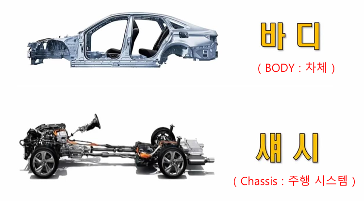 

자동차는 크게 **바디(BODY)** 와 **섀시(Chassis)** 로 구분된다.

- **바디 (BODY)**: 차량 외형과 탑승 공간, 차체, 내·외장 부품, 전기 배선 시스템 포함.  
- **섀시 (Chassis)**: 주행 및 동력 전달에 필요한 모든 기계적 장치 포함.  
  - 주행 장치: 현가장치, 조향장치, 제동장치  
  - 구동 장치: 엔진, 변속기, 동력전달계통  

최근에는 고효율화, 경량화, 승차감 향상, 안전성 강화를 목표로 바디와 섀시 설계가 통합되고, 전장 기술과 전기차 보급으로 자동차 기술 전반에 큰 변화가 일어나고 있다.

---

## 1장. 자동차 바디 (BODY)
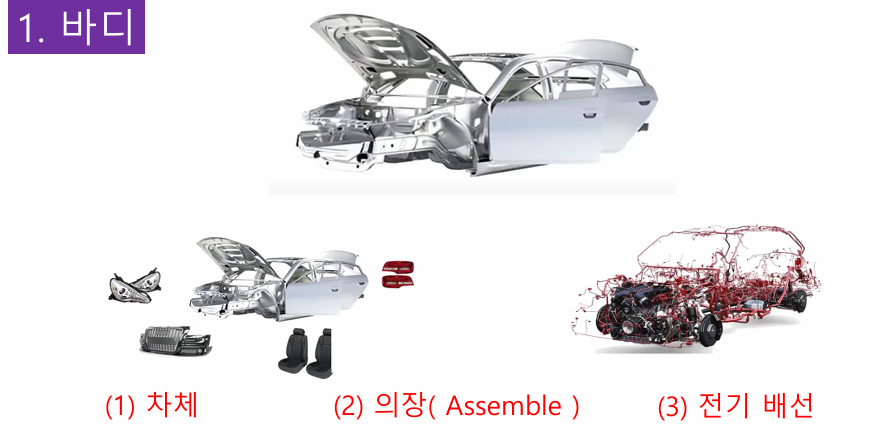 

자동차 바디는 또 크게 **차체**, **의장(assemble)**, **전기 배선** 3가지로 구분된다.

### 1.1 차체 구조

    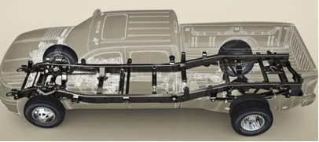
    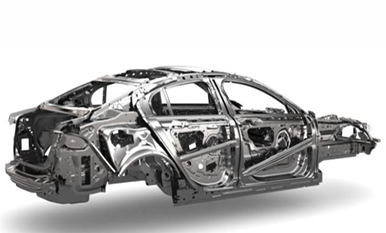

 

#### **프레임 바디 (Body on Frame)**
  - 장점: 내구성 우수, 충격에 강함, 대형 트럭 및 일부 SUV 사용
  - 단점: 무게 증가로 인한 연비 저하, 승차감 열세
  - 적용 차량: 렉스턴, 모하비, 픽업트럭, 1톤 트럭

#### **모노코크 바디 (Uni-Body)**
  - 장점: 경량화, 연비 향상, 충격 흡수 설계 용이
  - 단점: 사고 시 전체 구조 손상, 수리 비용 증가, 소음 전달 문제
  - 보강 구조: 사이드 멤버, 크로스 멤버, 서브프레임, 패널 사용
  - **사이드 멤버 (Side Member)**  
    - 차량 바닥 좌우 측면을 따라 길게 배치된 구조로, 측면 충돌 시 충격을 분산하고 차체 강성을 유지
    - 주로 고강도 강판을 사용하며, 차체 비틀림 방지 역할을 수행
  - **크로스 멤버 (Cross Member)**  
    - 사이드 멤버를 가로지르는 구조로, 전·후방 충돌이나 비틀림 하중에 대응 
    - 엔진, 변속기 등 주요 부품의 하중을 분산시키고, 서브프레임 역할도 수행
    - 하부 프레임을 **井 (정자형)** 또는 **H형** 형태로 보강하여 강성을 높임

  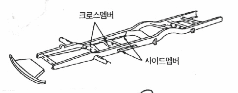 

---

### 1.2 의장 부품(외장) (Exterior Components)

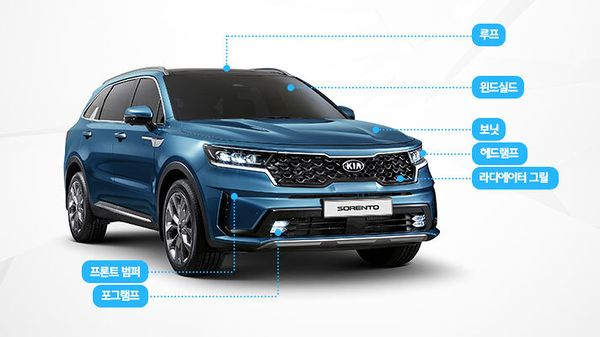

- **전면 (Front)**  
  - **Front Combi Lamp**
    - **헤드램프**: 전방을 비추는 조명장치. 아래에서 더 자세히 설명.
    - **방향지시등**: 차선 변경 시 진행 방향을 알리는 램프.
    - **DRL(주간 주행등)**: 주간 시인성 향상, 주로 LED 적용.
    - **미등**: 야간 시인성 향상, 많이 어둡지 않을 경우 사용.
  - **라디에이터 그릴**: 엔진 냉각을 위한 공기 유입구, 디자인적 상징성.  
  - **프론트 범퍼**: 충돌 시 충격 흡수, 보행자 보호 설계.

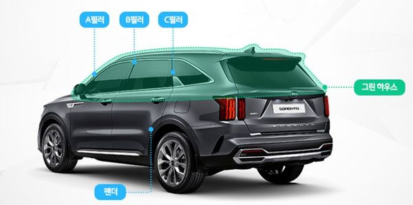

- **측면 (Side)**  
  - **도어**: 탑승자 출입구, 충돌 시 측면 보호 역할.  
  - **사이드 미러**: 후측방 시야 제공, 전동 접이식, 히팅, 카메라 기능 포함 가능.  
  - **펜더**: 자동차 타이어를 감싸고 있는 차체 패널 부분
  - **로커 패널**: 하부 보강, 차체 강성 유지, 외부 충격 보호.  

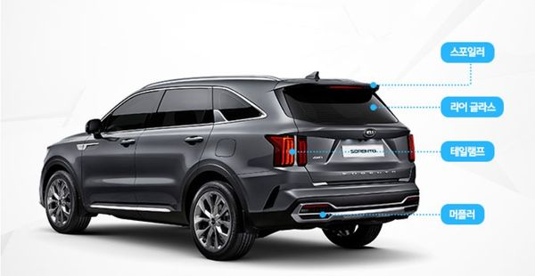

- **후면 (Rear)**  
  - **Rear Combi Lamp**
    - **브레이크등**: 차량 제동 시 작동.
    - **방향지시등**: 차선 변경 시 진행 방향을 알리는 램프.
    - **후진등**: 차량 후진 시 신호를 보냄.
    - **후미등**: 차량 존재 확인
  - **트렁크 리드/테일 게이트**: 화물 적재 공간 출입구.  
  - **리어 범퍼**: 후방 충돌 시 충격 흡수.  
  - **스포일러**: 고속 주행 시 차체 안정성 향상, 디자인 포인트.  

#### 헤드램프 (Headlamp) 

- **기능**: 야간 주행 시 시야 확보, 주간 주행등(DRL) 기능, 디자인 요소로도 중요.
- **기술 발전 단계**:  
  1. **할로겐 램프**  
     - 구조: 불활성 가스와 소량의 할로겐 가스를 채운 전구에 텅스텐 필라멘트 사용.  
     - 원리: 필라멘트에서 튀어나온 텅스텐이 할로겐 가스와 결합 후 다시 필라멘트로 돌아가 반영구적 사용 가능.  
     - 장점: 긴 수명(20년 이상), 저렴한 가격.  
     - 단점: 낮은 밝기, 높은 소비 전력.  
     
  2. **HID 램프 (High Intensity Discharge)**  
     - 원리: 12V 전압을 발라스터, 이그나이터를 통해 20,000V까지 승압.  
     - 제논 가스와 고전압 자유 전자가 충돌해 아크 방전 발생.  
     - 안정기가 80V로 아크 방전을 일정하게 유지.  
     - 장점: 밝기가 높고 넓은 조사 범위.  
     - 단점: 눈부심 유발, 고장 시 교체 비용이 높음.  

  3. **LED 램프 (Light Emitting Diode)**  
     - 특징: 반도체 소자에서 빛을 발생, 다양한 디자인과 고휘도 구현 가능.  
     - 발열 문제로 냉각 팬 필요.  
     - 장점: 낮은 소비 전력, 빠른 응답 속도, 긴 수명.  
     - 단점: 초기 설치 비용이 높고, 열 방출 관리 필요.  

- **추가 기술 요소**:  
  - 핸들 조향에 따라 빔 방향이 움직이는 AFS(Adaptive Front-lighting System) 적용.  
  - 주간주행등(DRL) 도입으로 안개등 의무화 폐지, 디자인 자유도 증가.  
  - 시퀀셜 턴 시그널 등 최신 방향지시등 디자인 적용.  

---

### 1.3 의자 부품(내장) (Interior Components)
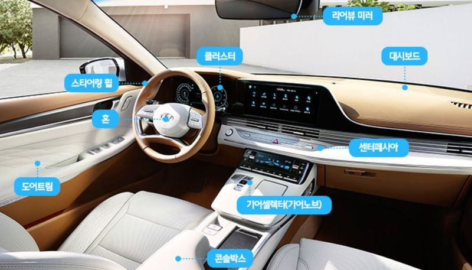

- 전면 (Front Interior)
  - **대시보드 (Dash Board)**: 계기판, 인포테인먼트 장치, 송풍구 포함.
  - **센터 페시아 (Center Fascia)**: 공조장치, 라디오, 송풍구 조작 장치, 인포테인먼트 디스플레이.
  - **계기판 (Cluster)**: 주행 정보 제공, 아날로그 및 디지털 방식 혼용.
  - **스티어링 휠 (Steering Wheel)**: 조향 조작부, 멀티펑션 버튼 포함.
  - **스티어링 칼럼 (Steering Column)**: 틸트 & 텔레스코픽 레버로 높이·거리 조절.
  - **글로브 박스 (Glove Box)**: 수납 공간, 장갑 보관에서 유래.
  - **오버헤드 콘솔 (Overhead Console)**: 실내등, 선루프 스위치, 선글라스 보관함.
  - **선바이저 (Sun Visor)**: 조명과 화장거울 포함.
  - **룸미러 (Rear View Mirror)**: ECM 감광식 미러, 하이패스 기능 내장.

- 중앙 (Center Interior)
  - **센터 콘솔 (Center Console)**: 컵홀더, 콘솔 박스, 팔걸이(Arm Rest) 포함.
  - **기어 레버 (Gear Lever)**: 전통적 셀렉터, 전자식 다이얼, 버튼식 등 다양한 형태.
  - **주차 브레이크 (Hand Brake)**: EPB (전자식 주차 브레이크) 포함.

- 시트 & 도어 (Seats & Doors)
  - **시트 (Seats)**: 통풍, 열선, 마사지 기능 가능.
  - **헤드레스트 (Head Rest)**: 탑승자 목 보호, 높이 조절 가능.
  - **사이드 볼스터 (Side Bolster)**: 좌우 지지대, 주행 시 몸 흔들림 방지.
  - **어시스트 그립 (Assist Grip)**: 승하차 시 지지용 손잡이.
  - **헤드라이너 (Headliner)**: 차량 천장 마감재.
  - **시트벨트 (Seat Belt)**: 프리텐셔너 포함, 안전 보호 장치.
  - **도어 트림 (Door Trim)**: 도어 오프너, 암레스트, 수납 포켓, 스피커 그릴 포함.
  - **시트 백 포켓 (Seat Back Pocket)**: 시트 뒷면 수납 공간.

- 기타 (Additional Interior Components)
  - **HUD (Head-Up Display)**: 주행 정보를 전방 유리에 투사.
  - **컬럼 스위치 (Column Switch)**: 방향지시등, 와이퍼 조작.
  - **락커 스위치 (Locker Switch)**: 구동 모드 제어, 락 기능.
  - **푸시 버튼 (Push Button)**: 엔진 시동용 버튼.
  - **다이얼 노브 스위치 (Dial Knob Switch)**: 주로 기어 셀렉터로 사용.
  - **패들 시프트 (Paddle Shift)**: 스티어링 휠에 부착된 수동 변속 장치.

---

### 1.4 전기 배선 (Electrical Wiring - 하네스)

- **하네스 정의**: 자동차 내 신호와 전력을 전달하는 배선망.  
- **경량화**: 과거 2km → 현재 200m 내외.  

- **주요 하네스 종류**:  
  - 메인 하네스  
  - 프론트 하네스  
  - 에어백 하네스 (노란색 마킹)  
  - 고전압 하네스 (오렌지색 마킹)

- **고전압 시스템**:  
  - 400V ~ 800V 고전압 사용 (현대 EGMP 플랫폼: 800V).  
  - 고속 충전과 효율적 동력 전달 가능.  
  - 안전을 위한 절연 및 색상 구분 필수.

---

## 2장. 섀시 (Chassis)

### 2.1 주행 장치 개요  
- 주행 장치는 **현가 장치(서스펜션)**, **조향 장치**, **제동 장치**로 구성된다.  
- 차량의 지지, 주행 안정성, 방향 전환, 제동 기능을 담당한다.  

---

### 2.2 주행 장치 - 현가 장치 (Suspension System)  

- **기능**: 노면 충격 흡수, 승차감 향상, 주행 안전성 확보.  
- **구성 요소**:  
  - 스프링 (코일, 리프, 에어 스프링)
  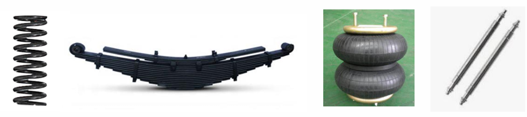
  - 쇼크 업소버 (댐퍼)
  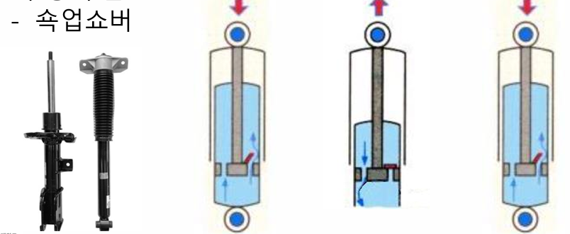
  - 암(Arm): 어퍼암, 로어암, 트레일링 암, 위시본  
  - 고무 부싱 (진동·소음 저감, 마찰 방지)  

- **종류**:  
  - **일체 차축 현가장치**: 프레임 바디, 스프링과 쇽업쇼버 일체화. 요철 통과 시 전체 차체가 함께 움직임.  
  - **독립 현가장치**: 바퀴마다 독립적 운동, 승차감 우수.  
    - 위시본, 멀티링크, 맥퍼슨 스트럿, 트레일링 암(토션빔) 타입으로 구분.
    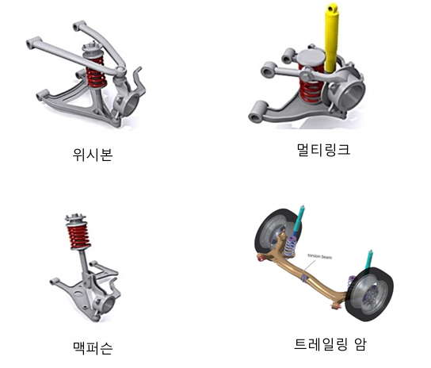
    - 아이오닉5: 앞 맥퍼슨 스트럿, 뒤 멀티링크 적용.

- **첨단 기술**:  
  - **전자제어 서스펜션 (ECS)**: 주행 상황에 따라 컴퓨터로 감쇠력 자동 조절.  
  - **에어 서스펜션**: 높이·강도 조절 가능, 고급차량 및 상용차에 적용.  

---

### 2.3 주행 장치 - 조향 장치 (Steering System)  

- **기능**: 차량의 주행 방향을 변경, 조향 응답성 향상.  
- **조향 원리**:  
  - **에커먼-장터 원리**: 회전 시 안쪽 바퀴 조향각이 크고, 바깥쪽은 작아 타이어 마모 감소.
    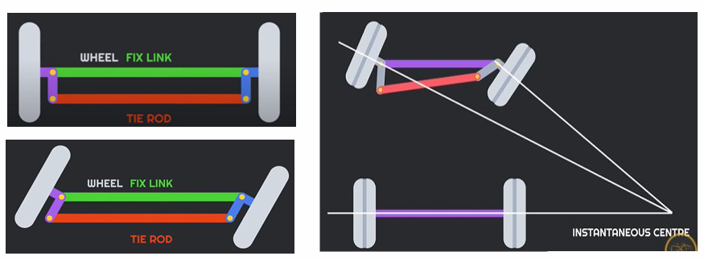
- **조향 장치 구성 요소**:  
  - (1) 스티어링 휠, (2) 스티어링 칼럼, (3) 조향 기어(피니언 & 랙), (4) 타이로드, (5) 너클 & 허브.
    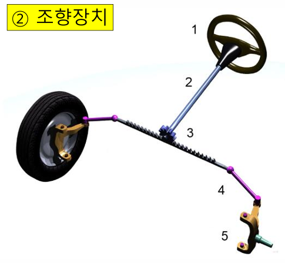
- **조향 장치 발전**:  
  1. *기계식 조향* (Manual Steering)  
  2. *유압식 파워 스티어링 (HPS)* – 유압 오일로 보조, 동력 손실.  
  3. *전자식 파워 스티어링 (EPS)* – C-MDPS (모터 핸들부), R-MDPS (모터 바퀴 근처).
     - MDPS(Motor-Driven Power Steering)
     - C-MDPS: 소형차에 적용.  
     - R-MDPS: 고급차, 빠른 응답성.  

---

### 2.4 주행 장치 - 제동 장치 (Braking System)  

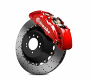

- **기능**: 차량 감속 및 정지, 주행 중 안전 확보.  
- **제동 원리**:  
  - *파스칼의 원리* 적용: 유압을 통해 작은 힘으로 큰 제동력 발생.  
  - 예시:  
    - P = F1/A1 = F2/A2 → 작은 페달 힘이 큰 브레이크 패드 힘으로 증폭.  

- **제동 장치 종류**:  
  - *유압식 브레이크*: 디스크, 드럼 브레이크 적용.  
  - *공기 브레이크*: 대형 상용차에 사용, 고압 공기로 작동.  
  - *전자식 브레이크 (SBW)*: 전기차, 하이브리드차 적용, 페달 입력과 브레이크 작동 분리.  

- **보조 제동 장치**:  
  - 엔진 브레이크, 배기 브레이크, 리타더 브레이크 (대형차 감속 장치).  

- **전기차 회생제동 시스템**:  
  - 감속 시 모터가 발전기로 작동, 전기를 다시 배터리에 저장.  
  - 완전 정지를 위해 유압 브레이크 병행 필요.  

---

### 2.5 구동 장치(Powertrain) 개요 
 
- 구동 장치는 엔진, 변속기, 차동장치, 추진축 등으로 구성되며, 엔진에서 발생한 동력을 바퀴에 전달하여 차량을 움직이게 한다.  
- 전기차의 경우, 배터리와 모터가 엔진과 변속기의 역할을 대체한다.  

---

### 2.6 엔진 시스템 (Engine System)

#### 엔진 시스템 개요  

- 엔진은 차량의 핵심 동력 발생 장치로, 연료의 화학 에너지를 기계적 에너지로 변환하여 차량을 구동합니다.  
- 흡입, 압축, 폭발, 배기의 4행정 과정을 통해 동력을 생산하며, 현대 엔진은 전자제어장치(ECU)와 다양한 센서를 통해 최적의 연료 분사와 점화 시점을 제어합니다.  
- 엔진의 효율성과 출력, 배출가스 저감, 내구성을 높이기 위한 다양한 기술이 적용되고 있습니다.

#### 엔진 주요 구성 요소  
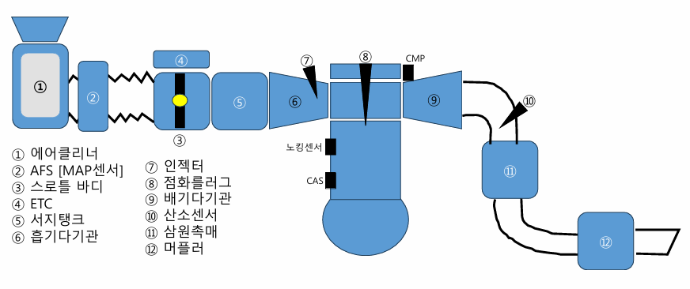

- **내부 부품**:  
  - 크랭크축(Crankshaft): 회전 동력을 발생시킴.  
  - 피스톤(Piston): 연소 가스를 기계적 에너지로 변환.  
  - 흡기/배기 밸브(Intake/Exhaust Valve): 공기 유입과 배기가스 배출 조절.  
  - 캠축(Camshaft): 밸브 작동 시점 제어.  
  - 점화플러그(Spark Plug): 점화 장치.  
  - 인젝터(Injector): 연료 정밀 분사.  

- **외부 부품**:  
  - 에어클리너: 흡입 공기 정화.  
  - 스로틀 바디 및 ETC: 흡입 공기량 조절.  
  - 삼원촉매(TWC): 배기가스 정화 장치.  
  - 머플러: 배출가스 소음 감소.  

#### 엔진 주요 센서 5종  

1. **산소 센서 (Oxygen Sensor)**  
   - 배기가스 내 산소 농도를 측정하여 ECU에 전달.  
   - 연료 분사량과 공기량을 조절해 배기가스 저감 및 연비 향상.

2. **AFS / MAP 센서 (Air Flow Sensor / Manifold Absolute Pressure Sensor)**  
   - AFS: 흡입 공기량을 정밀하게 측정, 고급형 센서.  
   - MAP: 흡기 다기관 압력 측정으로 공기량 추정, 저가형.  
   - ECU는 이 데이터를 바탕으로 이상적인 공기-연료 비율(14.7:1)을 유지.

3. **크랭크각 센서 (CAS: Crank Angle Sensor)**  
   - 크랭크축 회전 위치 및 속도 측정.  
   - 피스톤 상사점(TDC) 확인, 점화 및 분사 타이밍 제어.

4. **캠축 위치 센서 (CMP: Cam Position Sensor)**  
   - 캠축 회전 위치 측정, 밸브 타이밍과 연료 분사 최적화.

5. **노킹 센서 (Knock Sensor)**  
   - 이상 폭발(노킹) 감지, ECU에 신호 전달하여 점화 시점 조정, 엔진 보호 및 효율 향상.

#### 엔진 기술 발전  

| 세대 | 기술                      | 특징                        |
|------|---------------------------|----------------------------|
| 1세대 | 기화기 엔진 (Carburetor)  | 연료 공급 조절 미흡, 매연 발생 많음 |
| 2세대 | MPI (Multi-Point Injection) | 다점 분사, 연비 및 배기가스 저감 |
| 3세대 | GDI (Gasoline Direct Injection) | 고압 직분사, 연료 효율 향상, 배기가스 감소 |
| 디젤 | CRDI (Common Rail Direct Injection) | 고압 분사, 소음·진동 감소, 배출가스 저감 |
| LPG  | LPI (Liquid Propane Injection) | 액체 상태로 분사, 효율적 연소 |

#### 엔진 연료 종류  

- 가솔린 (휘발유)  
- 디젤 (경유)  
- LPG (액화석유가스)  
- 알코올 (Flex Fuel)  
- 수소  
- 전기 (모터 구동)  

---

### 2.7 변속기 (Transmission)  
- 엔진의 회전 속도와 토크를 바퀴에 맞게 변환하는 장치.  
- 종류:  
  - 수동 변속기 (MT)  
  - 자동 변속기 (AT)  
  - 무단 변속기 (CVT)  
  - 듀얼 클러치 변속기 (DCT)  
  - 전기차: 감속기 사용 (감속 비율로 속도·토크 조정)  

---

### 2.8 동력 전달 장치 (Final Drive System)  
- **클러치 (Clutch)**: 엔진과 변속기 사이 동력 전달 연결·차단.  
- **프로펠러 샤프트 (Propeller Shaft)**: 변속기에서 차동기로 동력 전달.  
- **차동장치 (Differential Gear)**: 좌우 바퀴 회전 속도 차이를 조절, 회전 시 안정성 확보.  
- **구동축 (Drive Shaft)**: 차동장치에서 바퀴로 직접 동력 전달.  

---

### 2.9 구동 방식 (Drivetrain Layout)  

| 구동 방식 | 특징               | 장점           | 단점           |
|------------|--------------------|----------------|----------------|
| FR (후륜구동) | 앞 엔진, 뒷바퀴 구동 | 운동 성능 우수  | 공간 효율 낮음 |
| FF (전륜구동) | 앞 엔진, 앞바퀴 구동 | 공간 효율 높음 | 언더스티어 발생 |
| AWD (상시 4륜) | 네 바퀴 동시 구동    | 접지력 우수    | 연비 저하      |
| 4WD (선택형 4륜) | 필요 시 4륜 전환    | 오프로드 적합  | 구조 복잡, 무게 증가 |

---

### 2.10 전기차 동력 시스템  

- **배터리 (Battery)**: 고전압 (400V~800V), 현대 EGMP 플랫폼은 800V 사용.  
- **구동 모터 (Motor)**: 인버터 제어로 고속 회전, 감속기를 통해 바퀴로 동력 전달.  
- **인버터 (Inverter)**: 직류(DC) 전원을 교류(AC)로 변환해 모터 제어.  
- **감속기 (Reduction Gear)**: 고속 회전을 저속·고토크로 변환.  
- **회생제동 시스템 (Regenerative Braking)**: 감속 시 발생하는 운동 에너지를 전기 에너지로 변환, 배터리에 저장.  

---