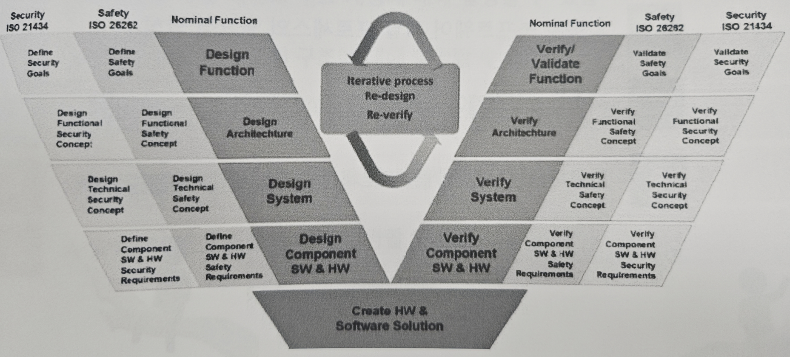

## 소프트웨어 설계

- 프로그램을 구현하기 전에 소프트웨어를 구성하는 요소와 구조를 정의해 구현의 기반을 만드는 활동
- **아키텍처 설계**: 구조 설계, DB 설계, 인터페이스 설계
- **상세 설계**: 컴포넌트 설계, 자료구조 설계, 알고리즘 설계

### 소프트웨어 설계 방법의 유형

- 구조적 소프트웨어 설계
- 객체지향 소프트웨어 설계

### 소프트웨어 아키텍처 설계

- 상위 수준에서 소프트웨어 구성 요소 간의 관계로 구성된 전체적인 구조를 설계하는 활동

### 3-레벨 모니터링 정적 아키텍처 예시

- **레벨 1(기능 레벨)**: 구현 대상 기능
- **레벨 2(모니터링 레벨)**: 모니터링 기능
- **레벨 3(제어 레벨)**: 하드웨어 모니터링(응답), 하드웨어 모니터링(질의), 부팅 시 ASIC 진단

### 소프트웨어 아키텍처 설계 원칙

- 높은 응집력, 낮은 결합도
- 모듈 내 구성 요소들의 상호 관련 정도는 높게, 모듈 간 의존 정도는 낮게 설계

### 소프트웨어 아키텍처 품질 속성

- 기능성, 신뢰성, 사용성, 효율성, 유지보수성, 이식성

### 소프트웨어 상세 설계

- 아키텍처 설계에서 도출된 소프트웨어 구성 요소(컴포넌트, 모듈)들의 내부 데이터와 알고리즘 로직 등을 설계하는 활동

### [[실습] 아키텍처 및 상세 설계하기](실습/실습8.md)

---

## 소프트웨어 구현 및 통합

### 소프트웨어 구현

- 개별 소프트웨어 단위를 실행 가능한 형태로 구현하고, 이를 문서화하는 활동 (프로그래밍)

### 소프트웨어 코딩 표준

- 코딩 표준을 지키지 않아 발생한 대표적인 사고가 **도요타 급발진 사고**임.

### [예제] 코딩 표준

- **Rule #1**: 지역 변수는 사용하기 전에 초기화해야 한다.
- **Rule #2**: 메모리 버퍼에 값을 쓰거나 읽을 때 적절한 조건을 설정하여 정해진 범위를 벗어나지 않도록 해야 한다.
- **Rule #3**: 나누기 연산을 수행하기 전에 제수가 0인지 확인해야 한다.

- 이러한 코딩 규칙은 **요구사항에 명세**되어 있어야 한다.

### 순환 복잡도 (Cyclomatic Complexity)

- 프로그램의 논리적 복잡도를 정량적으로 측정하기 위해 사용하는 메트릭

### 소프트웨어 통합

- 개발된 단위 모듈 소프트웨어들을 **통합 계획**에 따라 통합하여 완전한 소프트웨어 구조를 개발하는 활동
- 통합 시 가장 중요한 부분은 **통합 계획 기반**으로 진행해야 한다.
- 아키텍처 설계 단계에서 통합 및 테스트 과정 또한 같이 설계해야 한다.

#### 통합 방법

- **빅뱅 통합**
  - 모든 모듈을 한꺼번에 통합하여 테스트
  - 오류 발생 시 원인 파악이 어려움

- **하향식 통합**
  - 상위 모듈부터 하위 모듈로 점진적으로 통합

- **상향식 통합**
  - 하위 모듈부터 테스트 후 상위 모듈로 점진적 통합

- **지속적 통합 (Continuous Integration, CI)**
  - SW 통합 오류를 **개발 초기부터 예방**
  - 구현 후반에 발견되는 문제를 줄이기 위해 구현 초기에 CI를 적용
  - 도구가 자동으로 검사/보고하여 품질과 안정성을 조기에 확보

---

## 소프트웨어 검증 및 확인

### Verification과 Validation 차이

- **Verification**: Spec 기반 → 소프트웨어가 요구사항에 부합하여 구현되었음을 보장
- **Validation**: User Intended → 사용자의 의도한 요구사항에 따라 구현되었음을 보장

### Verification (검증) 정의

- 제품이 올바르게 만들어지고 있는가? (Based on spec)

### Validation (확인) 정의

- 올바른 제품을 만들고 있는가?

---

## 소프트웨어 테스팅

- 정상 조건 및 비정상 조건(결함/버그)을 찾아내기 위해 소프트웨어 항목을 분석하고, 분석된 항목의 특성을 평가하는 프로세스  
→ **결함을 발견하려는 의도로 프로그램을 실행**하는 프로세스

### Error, Defect, Failure

- **에러 (Error)**: 결함의 원인으로 사람이 만든 실수
- **결함 (Defect)**: 제품 내 결점으로 실패/고장의 원인
- **실패 (Failure)**: 결함이 실행되어 발생하는 현상

### 소프트웨어 개발 단계별 테스팅 활동

| 테스트 수준    | 단위 테스트    | 통합 테스트    | 시스템 테스트    | 인수 테스트    |
|----------------|---------------|----------------|-----------------|----------------|
| 테스트 대상    | 모듈(유닛)    | 모듈 간 인터페이스    | 통합된 전체 소프트웨어    | 통합된 전체 소프트웨어    |
| 테스트 기준    | 상세 설계서    | 명세서, 아키텍처 설계서    | 요구 명세서    | 요구 명세서    |
| 테스트 환경    | 개발 환경    | 개발 환경    | 실제와 유사한 환경    | 실제 환경    |
| 테스트 관점    | White Box    | Gray Box (White + Black)    | Gray Box (White + Black)    | Black Box    |
| 사용자 관점    | 개발자    | 개발자    | 시험자, 고객    | 사용자, 고객    |

### 블랙박스 테스팅과 화이트박스 테스팅

- **블랙박스 테스팅**: 소스 코드 로직 제외, 출력 값에 초점. 명세 기반 테스트
- **화이트박스 테스팅**: 코드 내부의 모든 독립 경로를 수행하여 결함을 탐지. 구조 기반 테스트

### 블랙박스 테스팅 개요

- 요구사항 명세서/설계서로부터 테스트 케이스 추출

#### 테스팅 기법

- **신택스 테스팅**: 입력 값을 적합/부적합으로 분류 후 테스트
- **동등 분할**: 입력 범위에서 대푯값 선정 후 테스트
- **경계 값 분석**: 주요 오류 대상인 경계 값을 입력 값으로 테스트
- **의사결정 테이블**: True/False 경우의 수를 모두 테스트

### [[실습] 블랙박스 테스트 케이스 만들기](실습/실습10.md)

### 화이트박스 테스팅 개요

- 소스 코드 내부의 모든 독립 경로를 테스트

#### 커버리지 수준

- **함수 커버리지**: 함수가 모두 테스트되었는지 확인
- **문장 커버리지**: 코드의 모든 문장이 최소 1회 실행되도록 테스트
- **결정(분기) 커버리지**: 분기문이 참/거짓 모두 발생하도록 테스트
- **조건 커버리지**: 복합 조건 내 각 개별 조건이 참/거짓 모두 되도록 테스트
- **경로 커버리지**: Flow Graph 기반으로 독립 경로를 모두 테스트

### 경로 커버리지 프로세스

1. **Flow Graph 작성**: 입력~출력까지의 내부 구조 시각화
2. **순환 복잡도 계산**: 독립 경로의 수 계산
3. **독립 경로 정의**: 테스트할 경로 정의
4. **테스트 케이스 작성**: 각 경로 테스트 케이스 작성

---

## 소프트웨어 형상관리

### 형상 (Configuration)이란?

- 일반 형상: 컴퓨터 부품들의 구성
- 하드웨어 형상: 목적에 맞는 구성 요소 집합
- 소프트웨어 형상: SW 산출물(요구사항 명세서, 소스 코드 등)의 구성

### 베이스라인 개념

- 개발의 기준이 되는 공식 승인 상태로 **형상 통제** 절차를 통해서만 변경 가능

### 소프트웨어 형상 관리

- 형상 항목을 식별하고 변경을 통제, 처리 상태 모니터링
→ 무결성, 추적성 확보

#### 주요 활동

- **형상 식별**: 관리 대상 항목과 베이스라인 선정
- **형상 통제**: 변경 요청 평가 및 협의
- **형상 상태 보고**: 베이스라인 상태 및 변경 사항 보고
- **형상 감사**: 계획대로 형상 관리가 진행되는지 검토

### 형상 통제 위원회

- **CCB (Change Control Board)**에서 변경 요청 평가 및 협의

---

## 소프트웨어 추적 관리

### 요구사항 추적 관리

- 요구사항과 다른 개발 산출물(설계, 구현, 테스트 등) 간 연결 관계 관리

### 요구사항 추적 관리의 필요성

#### 1. 변경(Impact) 분석

- 변경 시 영향 범위를 파악하여 빠르고 정확하게 대응

#### 2. 일관성 확보

- 전 과정(요구사항 → 설계 → 구현 → 테스트)에서 일관성 유지

#### 3. 요구사항 커버리지

- 모든 요구사항이 설계/구현/테스트에서 충분히 반영되었는지 확인

---

## 자동차 사이버보안 트렌드

### 일반적인 보안의 개념

- 외부 위협으로부터 자유로운 상태

### ISO/SAE 21434 사이버 보안 표준

- 자동차 E/E 시스템 위협으로 인한 사고 방지 국제 표준

### 사이버 보안 소프트웨어 개발 생명주기

- 일반 SW 개발 생명주기에 **보안 관련 활동 및 기법** 포함

### TARA (Threat Analysis and Risk Assessment)

- 사이버 보안 측면의 핵심 활동
- 평가 항목: **Security Level = Threat Level + Impact Level**
- 결과: **Security Goal 도출**

### 자동차 분야 기능안전과 사이버보안 프로세스 통합

- **기본적인 V-Model 품질 활동**을 충실히 수행하면 대부분의 Security와 Safety를 만족할 수 있음

---

## 5일 간의 강의에 대한 마무리 멘트 형식 (작성 예시용 틀)

이번 5일 간의 강의를 통해 **소프트웨어 설계, 구현, 테스트, 형상 관리, 그리고 자동차 분야에서의 사이버 보안**까지 폭넓고 체계적인 내용을 학습할 수 있었습니다.  
특히, **이론뿐만 아니라 실습 중심의 학습 방식** 덕분에 각 개념을 실무에 적용하는 방법까지 이해할 수 있었던 점이 매우 유익했습니다.  

이번 교육에서 느낀 점과 앞으로 어떻게 배운 내용을 적용해 나갈지에 대한 저의 생각을 아래에 정리해보고자 합니다.

**[여기에 본인의 느낀 점과 다짐을 작성하세요.]**
