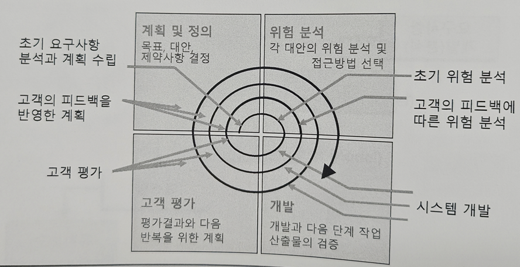

# 소프트웨어 개발 생명주기와 Automotive SPICE 정리

---

## 1. 소프트웨어 개발 생명주기의 정의
- 소프트웨어를 어떻게 개발할 것인가에 대해 정의한 **최상위 수준의 프로세스**

### 1.1 소프트웨어 개발 생명주기의 역할
- 소프트웨어 개발 단계의 정의
- 개발 접근 방식 제공
- 마일스톤(이정표)과 일정 수립의 기준
- 소프트웨어 비용 산정의 기준

---

## 2. 소프트웨어 개발 생명주기의 접근 방식

- **Big Bang Approach**  
- **Evolutionary Approach**

### 2.1 Big Bang Approach
- 개발이 한 번에 일어나며, 대부분의 활동이 뒤늦게 집중되는 접근
- Waterfall 모델과 같은 전통적 모델에서 사용
- 사용자의 피드백 반영이 늦음


### 2.2 Evolutionary Approach
- 반복적이고 점진적인 개발
- 프로토타입, 나선형 모델, 애자일 등이 포함됨
- 사용자의 피드백을 빠르게 반영 가능


---

## 3. 소프트웨어 개발 생명주기의 유형

### 3.1 주먹구구식 모델 (Build & Fix Model)
- 요구사항이나 설계 단계 없이 코딩 후 계속 수정
- 소규모, 단기 프로젝트에만 적합
- 유지보수와 품질 관리가 어려움

### 3.2 폭포수 모델 (Waterfall Model)
- 요구 → 설계 → 구현 → 테스트 → 운영의 순차적 개발
- **Big Bang** 방식
- 고객 요구사항이 명확하고 변경이 적은 경우 적합


### 3.3 원형 모델 (Prototyping Model)
- 원형(Prototype)을 먼저 개발해 고객과 요구사항 명확화
- **Evolutionary** 방식
- 초기 요구사항이 모호할 때 유용
- 성능, 보안은 고려되지 않을 수 있음


### 3.4 나선형 모델 (Spiral Model)
- 폭포수 + 프로토타입 + 위험 분석
- 반복적 개발과 위험 분석을 강조
- 고비용, 고위험 장기 프로젝트에 적합



---

## 4. V-Model 프로세스

### 4.1 정의
- 개발 생명주기의 각 단계와 테스트 단계가 **대칭적으로 매핑**된 모델
- 테스트 설계를 개발 초기부터 함께 수행
- **초기 품질 확보** 및 **검증 활동의 조기 시작** 강조 (Shift Left)


### 4.2 Verification vs Validation

| 항목 | Verification | Validation |
|------|--------------|------------|
| 의미 | 제품을 **제대로 만들었는가?** | 제품이 **제대로 된 것인가?** |
| 기준 | Specification | User needs |
| 관점 | 개발자 관점 | 사용자 관점 |
| 시기 | 개발 단계에서 반복 | 최종 제품 평가 시점 |

---

## 5. Automotive SPICE (A-SPICE) 개요

### 5.1 배경
- 유럽 OEM(예: Audi, BMW, VW 등)은 부품 업체의 소프트웨어 품질을 통일된 기준으로 평가하고자 HIS 그룹을 구성
- ISO/IEC 국제 표준 기반으로 자동차 산업 특화 프로세스 모델 개발

### 5.2 정의
- **Automotive SPICE**: Automotive Software Process Improvement and Capability dEtermination
- SPICE 기반의 자동차 분야 사실상 표준 (Defacto Standard)

---

## 6. A-SPICE 모델 구성요소

### 6.1 프로세스 참조 모델 (PRM)
- 평가 대상
- 프로세스 식별자, 이름, 목적, 기대 성과 등 정의
- ISO/IEC 12207 기반

예:
```text
ID: SWE.1  
이름: 소프트웨어 요구사항 분석  
목적: 시스템 요구사항 중 소프트웨어 관련 부분을 SW 요구사항으로 전환  
성과: 우선순위가 정의된 SW 요구사항 존재
````

### 6.2 프로세스 평가 모델 (PAM)

* 평가 지표
* 다음으로 구성됨:

  * 프로세스 수행 지표 (Base Practice, Work Product)
  * 프로세스 능력 지표 (Process Attribute, Generic Practice, Generic Resource)

### 6.3 측정 프레임워크 (Measurement Framework)

* ISO/IEC 33020 기반
* 프로세스 속성 달성도 측정 척도:

| 등급 | 의미                 | 달성도(%)   |
| -- | ------------------ | -------- |
| N  | Not Achieved       | 0\~15%   |
| P  | Partially Achieved | 15\~50%  |
| L  | Largely Achieved   | 50\~85%  |
| F  | Fully Achieved     | 85\~100% |

---

## 7. 프로세스 능력 수준 (Capability Level, CL)

| 수준   | 이름          | 특징                    |
| ---- | ----------- | --------------------- |
| CL 0 | Incomplete  | 프로세스 없음 또는 목적 미달성     |
| CL 1 | Performed   | 수행되지만 비체계적            |
| CL 2 | Managed     | 계획되고 관리됨              |
| CL 3 | Established | 조직의 표준 프로세스를 기반으로 수행됨 |
| CL 4 | Predictable | 정량적 품질 관리             |
| CL 5 | Innovating  | 지속적 개선 수행             |

### 예시: CL 2 도달한 SWE.1

* SWE.1에 해당하는 BP 및 WP가 계획적으로 수행되고 통제됨
* 요구사항 분석 문서가 관리되고, 검토 회의 기록 등 산출물이 존재함

---

## 8. A-SPICE 핵심 개념 요약

### 8.1 Plug-in 개념

* 제품 성격에 따라 도메인(소프트웨어, 하드웨어 등) 프로세스를 조합

### 8.2 V-Model 연계

* 좌측 개발 단계 ↔ 우측 테스트 단계 1:1 매핑
* 초기에 테스트 계획 수립 (Shift Left)

### 8.3 용어 정리

| 용어        | 설명                         |
| --------- | -------------------------- |
| Element   | 아키텍처 또는 설계 수준의 구조적 요소      |
| Component | SWE.2 수준의 설계 단위            |
| Unit      | 더 이상 분해되지 않는 최소 컴포넌트       |
| Item      | 테스트 대상 요소 (V 모델 오른쪽 대응 요소) |

### 8.4 추적성과 일관성

* **Traceability**: 요구 ↔ 설계 ↔ 구현 ↔ 테스트 간 연결성
* **Consistency**: 변경 시 관련 산출물 간 의미 일치 유지

### 8.5 의사소통(Communication)

* "합의하고 전달한다", "요약하고 전달한다"는 표현으로 업무 공유 강조

### 8.6 평가 관련 개념

* **Evaluate**: 대안을 비교 평가
* **Verification Criteria**: 사전에 정의된 검사 기준
* **Ensuring Compliance**: 테스트 결과가 요구사항을 충족하는지 보장

### 8.7 전략과 계획

* Strategy는 큰 틀의 수행 방법, 이를 구체화한 것이 Plan

---