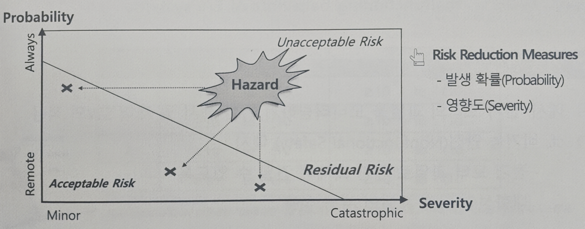
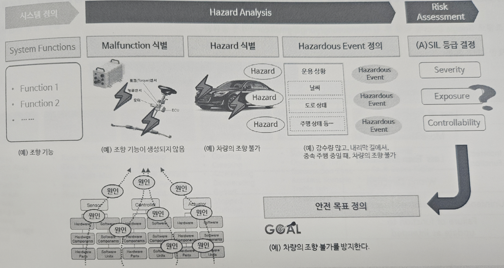
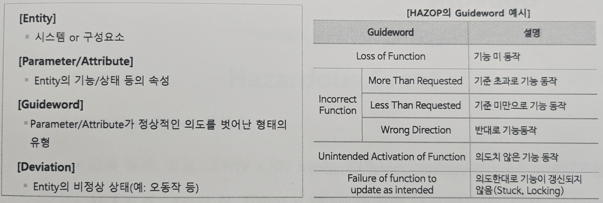

# ISO 26262 기능 안전 표준 핵심 개요 및 실무 적용 가이드

## 1. 개요

ISO 26262는 자동차 전기전자 시스템(E/E systems)의 **기능 안전**을 확보하기 위한 국제 표준입니다.  
본 문서에서는 기능 안전의 개념과 기본 용어, 안전 생명주기 프로세스, 소프트웨어 안전 설계, 리스크 평가 프로세스를 정리합니다.

---

## 2. 안전이란?

- **리스크**: 발생할 가능성이 있는 잠재적인 문제 (Potential Problem)
- **안전**: 리스크에 대해 수용 가능한 상태

### 2.1 일반적인 안전의 개념

- **ISO/IEC GUIDE 51**: 안전에 대한 최상위 국제 표준
- 정의: *Freedom from Unacceptable Risk*
- 리스크는 **발생 확률 (Probability)**과 **영향도 (Severity)**에 의해 평가됨
- **Hazard**: Potential source of harm
- **이슈**는 이미 발생한 문제로 **Severity**만 평가

### 2.2 안전 필수 시스템의 개념

- 인적, 환경적 심각한 피해를 유발할 수 있는 시스템
- **Life-critical System**이라 부름

---

## 3. 기능 안전 개념

- 정의: *No unacceptable risk due to hazards caused by malfunctioning behaviors of E/E systems*
- 기능 안전을 만족하기 위한 요구사항
  - **안전 기능 요구사항**: 시스템이 제공해야 할 안전 기능
  - **안전 무결성 요구사항**: 시스템이 요구하는 무결성 수준 (예: SIL 4)

### 3.1 안전 무결성

- 명시된 조건과 기간 내에서 요구된 안전 기능을 만족할 확률

### 3.2 기본 용어 정의

| 용어 | 정의 |
|---|---|
| **Harm** | 사람의 건강에 영향을 주는 손상 |
| **Accident** | Hazardous Event가 실제 발생한 상황 |
| **Hazardous Event** | Hazard + Operational Situation 조합으로 Accident 발생 가능 |
| **Hazard** | 위해를 일으킬 수 있는 잠재적 요인 |
| **Malfunction** | 정상 기능에서 벗어난 상태 |
| **Operational Situation** | 시스템이 노출되는 운용 환경 |
| **Risk** | Hazard가 Accident로 이어질 가능성과 심각도의 조합 |

[실습: 기능 안전 기본 용어 적용하기](실습/실습4.md)

---

## 4. 소프트웨어 안전 개념

### 4.1 정의

- *Freedom from Software Hazards*

### 4.2 소프트웨어 진흥법의 정의

- 내부적인 오작동 및 안전 기능 미비 등으로 발생 가능한 사고로부터 사람의 생명이나 신체에 대한 위험에 충분한 대비가 되어 있는 상태

### 4.3 보안과 안전 차이

- **보안**: 외부 침해 방지
- **안전**: 내부 오류가 외부로 전파되지 않도록 방지

### 4.4 Mistake, Fault, Error, Failure 용어 정의

| 용어 | 정의 | 예시 |
|---|---|---|
| **Mistake** | 사람이 실수로 결함을 주입 | 반복문 종료 조건 잘못 작성 |
| **Fault** | 오류를 유발하는 버그 | 무한 루프 (`while(1)`) |
| **Error** | 명세 결과와 실제 처리 결과가 다른 상태 | 계산 결과 오류 |
| **Failure** | 시스템이 요구된 기능을 수행 못하는 상태 | 로봇 충돌 |

---

## 5. Redundancy & Diversity

### 5.1 개념

- **Redundancy**: 동일한 방식으로 기능을 중복 설계
- **Diversity**: 다양한 방식으로 기능을 설계

### 5.2 Diversity 설계 방법 예시

- 다양한 알고리즘 사용
- 다양한 팀/개발자 참여
- 다양한 프로그래밍 언어 사용
- 다양한 설계 기법 적용
- 다양한 개발 도구 사용

---

## 6. ISO 26262 개발 배경 및 적용 대상

### 6.1 기능 안전 표준

- 자동차 E/E 시스템의 오동작과 Hazard로 인한 사고 방지 목적

### 6.2 적용 대상

- 자동차, 모터사이클, 상용차 (트럭/버스)  
  *(응급차 등 특수목적 차량 제외)*

---

## 7. ISO 26262 안전 생명주기

### 7.1 Concept Phase

- **Item Definition**: 시스템 정의
- **Initiation of Safety Lifecycle**: 안전 생명주기 시작
- **Hazard Analysis & Risk Assessment**: Hazard 분석 및 리스크 평가
- **Functional Safety Concept**: 기능 안전 요구사항 도출

### 7.2 Product Development

#### System Level

- 시스템 아키텍처 설계 및 안전 요구사항 반영

#### Hardware Level

- 하드웨어 설계 및 구현

#### Software Level

- 소프트웨어 설계 및 구현

#### Release

- 제품 생산 릴리즈 승인

### 7.3 After Release

- 생산 계획
- 운영 및 서비스 계획
- 제품 운영 및 폐기 관리

### 7.4 External Considerations

- 외부 보완 조치
- 운전자의 제어 가능성 (Controllability)
- 기타 기술 대응 수단

### 핵심 흐름

> Concept → 개발 (HW/SW) → Release → 생산/운영  
> External 요소는 전 단계에 걸쳐 지원/보완

---

## 8. 소프트웨어 안전 생명주기 및 아키텍처

### 8.1 안전 생명주기

- 일반 SW 개발 생명주기에 안전 관련 활동과 기법 포함

### 8.2 SW 안전 아키텍처 설계

- 추가 SW 컴포넌트 설계
- 결함 예방/감지/처리 설계 반영

### 8.3 센서 유효 영역 검사

- 센서 값의 유효 범위 검사를 통해 오류 검출
  - **유효 영역 검사기**
  - **고장 처리기**

### 8.4 메시지 타임아웃 모니터링

- 통신 메시지의 타임아웃 모니터링으로 오류 검출
  - **메시지 타임아웃 검사기**
  - **고장 처리기**

### 8.5 Fault Injection Testing

- 정상 상황에서 비정상 조건을 주입해 예외 대응 확인

---

## 9. 해저드 분석 및 리스크 평가

### 9.1 프로세스 목적

- 해저드 식별 및 *Unacceptable Risk* 예방/완화

### 9.2 오동작 식별

- 시스템 정상 기능에서 오동작 식별
- **HAZOP** 적용

- 예시: *What if 회전문.회전방향 = Wrong Direction? → 회전문의 방향 반전*

[실습: 오통작 식별](실습/실습5.md)

### 9.3 Hazardous Event 정의

- 시스템 운용 상황 + Hazard 조합 → Hazardous Event 정의

### 9.4 ASIL 등급 결정

- **Severity**: 위해 수준
- **Exposure**: 발생 빈도
- **Controllability**: 제어 가능성

[실습: Hazardous Event 정의 및 ASIL 등급 결정](실습/실습6.md)

---

## 10. ISO 21448 SOTIF (Safety Of The Intended Functionality)

- 자율주행 시스템의 의도된 기능이 불충분/부적절한 경우의 안전 확보를 위한 국제 표준
- 프로세스 및 V&V 기법 제공
