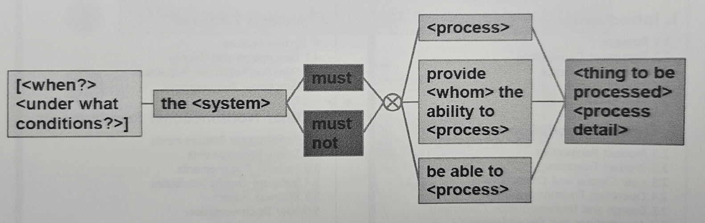

# 소프트웨어 요구사항 개발

## 요구사항의 정의
현실 세계의 문제를 해결하기 위하여 고객에 의해 요구되거나 표준 등을 만족하기 위해 제품이 가져야 하는 서비스 또는 제약사항

## 요구사항의 분류
- **고객 요구사항**: 고객이 개발 대상 제품에 대해 원하는 기대사항(Needs)
- **제품 요구사항**: 고객 요구사항을 만족하기 위해 제품이 수행해야 하는 개발 관점의 구체적인 요구사항
- **기능적 요구사항**: 제품이 목표를 달성하기 위해 사용자에게 제공해야 하는 행위적(기능적) 속성
- **비기능적 요구사항**: 제품의 기능이 성능, 안전성, 사용성 등의 품질 기준을 만족시키기 위해 가져야 하는 속성

## 요구사항의 중요성
- 소프트웨어 제품을 전체적으로 파악하도록 하며, 전체 개발 단계의 기준 및 가이드라인으로 활용됨

## 소프트웨어 요구 공학의 정의
- 소프트웨어를 개발하기 위한 요구사항을 **추출, 분석, 명세, 검증**하며, 개발된 요구사항의 변경 및 추적을 관리하는 공학적 접근 방법

---

# 요구사항 개발 관리 프로세스 (Requirements Engineering) - 공부 정리

## 전체 구조
- **중앙 원**: 요구사항 관리(Req. Management) 중심
- **원형 내부 순환**: 분석 → 명세 → 검증 반복
- **외곽 흐름**: 요구사항 개발 단계 진행 방향 (Candidate → Agreed → Formal → Baseline)

## 주요 단계 흐름

### 1. Candidate Requirement (후보 요구사항 단계)
- 초기 아이디어 수준 요구사항 → "요구사항 분석" 단계로 진행

#### 요구사항 분석 단계
- 기능 요구사항 분석
- 우선순위 결정
- 기타 분석 작업

### 2. Agreed Requirement (합의된 요구사항 단계)
- 승인 및 합의된 요구사항 → "요구사항 명세" 단계로 진행

#### 요구사항 명세 단계
- 요구사항 식별
- 요구사항 작성
- 기능 요구사항 명세

### 3. Formal Requirement (형식적 요구사항 단계)
- 문서화 및 검토 준비 완료 상태

#### 요구사항 검증 단계
- 검증 준비
- 검증 수행

### 4. Baseline Requirement (기준 요구사항 단계)
- 검증 완료 후 기준선(Baseline)으로 채택 → 설계/구현 기준으로 활용

#### 요구사항 도출 단계
- 이해관계자 요구사항 도출
- 신규 요구사항 도출 → 다시 Candidate 단계로 순환 가능

## 중앙 원 내부 순환 프로세스
- **Requirement Management(요구사항 관리)** 역할
    - 변경 관리
    - 추적성 관리
    - 상태 모니터링

- **순환 흐름**  
  Req. Analysis → Req. Specification → Req. Verification → 반복

## 핵심 메시지
- 요구사항 개발은 **순환적 관리 구조**로 이루어짐
- **요구사항 관리(Requirement Management)**는 모든 단계에 지속적으로 관여
- 각 단계는 명확한 상태 전이 존재 (Candidate → Agreed → Formal → Baseline)

## 결론
- 요구사항 개발 프로세스는 **ISO, A-SPICE, CMMI** 등 표준에서 채택하는 기본 모델
- **단방향 직진 흐름이 아니라 반복적이고 점진적인(Iterative & Incremental) 관리 필요**
- 요구사항 관리가 **프로세스 중심의 핵심 역할** 수행

---

# 요구사항 도출
- 핵심은 **이해관계자를 다양하게 찾아야 한다.**

# 요구사항 분석

## 구조적 분석
- 소프트웨어의 기능을 정의하기 위해 프로세스들을 도출
- 도출된 프로세스 간 **데이터 흐름 중심으로 정의**

## 객체지향 분석
- 사용자 중심의 **시나리오 분석** 중심으로 기능 정의

## 운용 관점 요구사항 분석
- 개발 대상 시스템의 운용 상태 및 모드 등을 고려하여 분석
- **State Machine Diagram** 사용

## 개발 관점 요구사항 분석
- 개발 대상 시스템과 외부 시스템과의 인터페이스 분석
- **IPO (Input-Process-Output) 관점**에서 점진적으로 분석
- **System Context Diagram, Data Flow Diagram** 활용

# 요구사항 명세
- **고객 요구사항 + 사용자 요구사항** → 통합
- 분류
    - 기능 요구사항
    - 품질 속성(기준)
    - 비기능 요구사항
- 추가 요소: **시스템 요구사항**, **전제조건** 포함  
→ 최종적으로 **소프트웨어 요구사항 명세서(SRS)** 작성

## Formal한 정도에 따른 명세 방법의 구분
- **Informal Notation**
    - 자연어 이용
    - 조직 내부의 다이어그램 표기법 사용
- **Semiformal Notation**
    - UML 등 모델링 언어 사용
    - 기능적/구조적/동적 관점 표현
- **Formal Notation**
    - 수학적 기호 등 정형화된 표현식 사용
    - 시스템도 이해 가능한 가장 정형화된 표기법

## 예제: Informal Notation
- **EARS (Easy Approach to Requirements Syntax)** 명세 기법  

> 운전자가 브레이크를 누르지 않았고, 차량이 안전 거리 이내로 진입하면, 크루즈 시스템 소프트웨어는 속도를 감속해야 한다.

[실습] 요구사항 개발하기 → 실습/실습7.md

# SW 안전 요구사항 개발 방법
- **Fault Detection 요구사항**
- **Fault Reaction 요구사항**  
→ 크게 두 분류로 나눌 수 있음

# 요구사항 검증
- 이해당사자 기대사항이 의도한대로 요구사항이 추출/분석되어 SRS가 작성되었는지 **검토/확인**

### 요구사항 검토 항목 예시
- 완전성
- 명확성
- 실현 가능성
- 추적 가능성

# A-SPICE 가장 중요한 점
- **요구사항 부분이 가장 중요**
- 검증 가능할 만큼 요구사항을 **자세히 작성**하는 것이 필요
- 개발 **초기 단계부터 명확히 정의**하는 것이 필요
