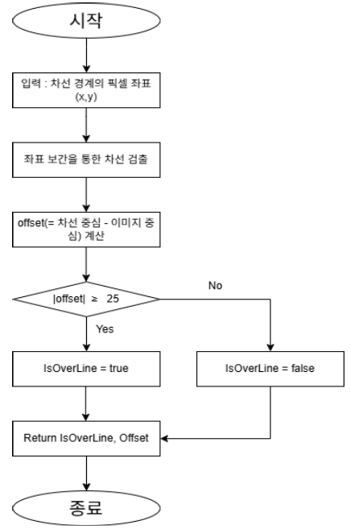
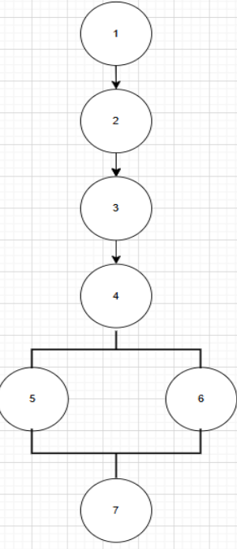

# [실습] 화이트박스 테스트 케이스 만들기

### 조원 : 오태성 외 6명

## 차선 이탈 감지 Flow Chart 테스트

    
    

### **순환 복잡도(CC)** = E - N + 2 = **2**

### **독립 경로**
- 경로 1 : 1 ➡️ 2 ➡️ 3 ➡️ 4 ➡️ 5 ➡️ 7
- 경로 2 : 1 ➡️ 2 ➡️ 3 ➡️ 4 ➡️ 6 ➡️ 7

## 테스트 케이스

| No. | 경로    | 입력 값 (Offset) | 예상 출력 값 (IsOverLine) |
|-----|---------|-----------------|--------------------------|
| 1   | 경로 1  | 5               | False                    |
| 2   | 경로 2  | -30             | True                     |

