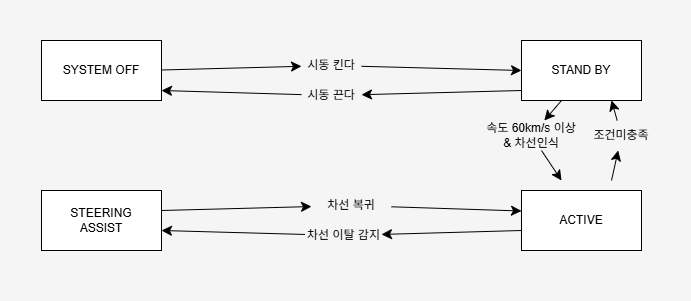

# [실습] 요구사항 개발하기

## 조원 : 오태성 외 6명

## 요구사항 분석(LKAS System) - State Machine Diagram

## 요구사항 명세(LKAS System) - EARS 방식

| 요구사항 번호 | 요구사항 내용 |
|---------------|----------------|
| 요구사항 1 - 시스템 활성화 | 운전자가 차량을 시동하고 LKAS 스위치를 켜면, LKAS 시스템은 대기(STAND BY) 상태로 전환되어야 한다. |
| 요구사항 2 - 차선 인식 | 차량 속도가 60km/h 이상이고 차선이 인식되면, LKAS 시스템은 능동 감시(Active) 상태로 전환되어야 한다. |
| 요구사항 3 - 차선 이탈 감지 | 차량이 차선을 벗어나려는 움직임이 감지되면, LKAS 시스템은 운전자 개입 없이 조향 보조(Steering Assist)를 수행해야 한다. |
| 요구사항 4 - 조향 보조 해제 | 운전자가 스티어링 휠을 직접 제어하기 시작하면, LKAS 시스템은 즉시 조향 보조를 해제하고 감시 상태(Active)로 전환해야 한다. |
| 요구사항 5 - 시스템 자동 해제 | 차선이 인식되지 않거나 속도가 60km/h 이하로 떨어지면, LKAS 시스템은 자동으로 대기(STAND BY) 상태로 전환해야 한다. |
| 요구사항 6 - 시스템 종료 | 운전자가 시동을 끄거나 시스템 오류가 발생하면, LKAS 시스템은 종료(SYSTEM OFF)되어야 한다. |

