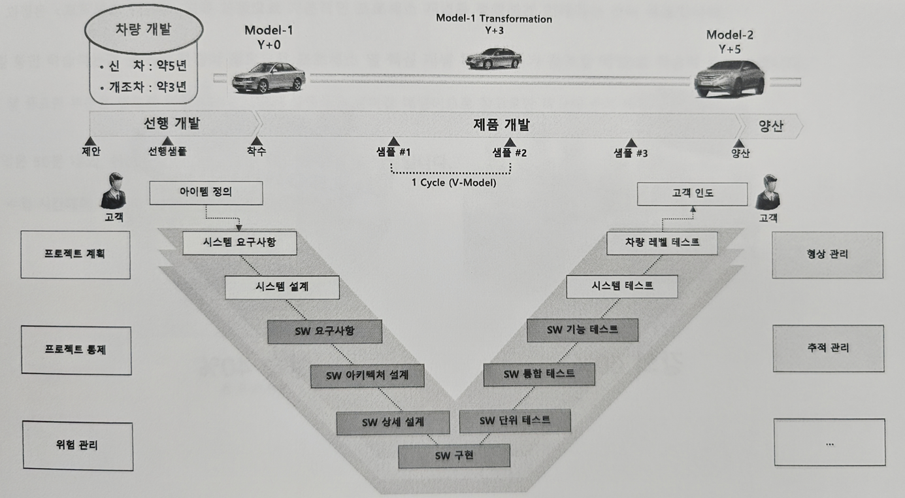
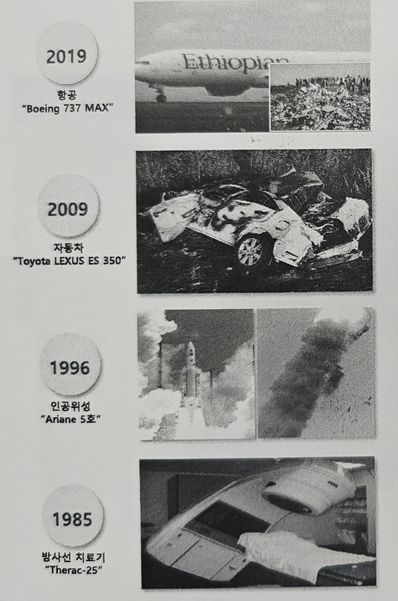
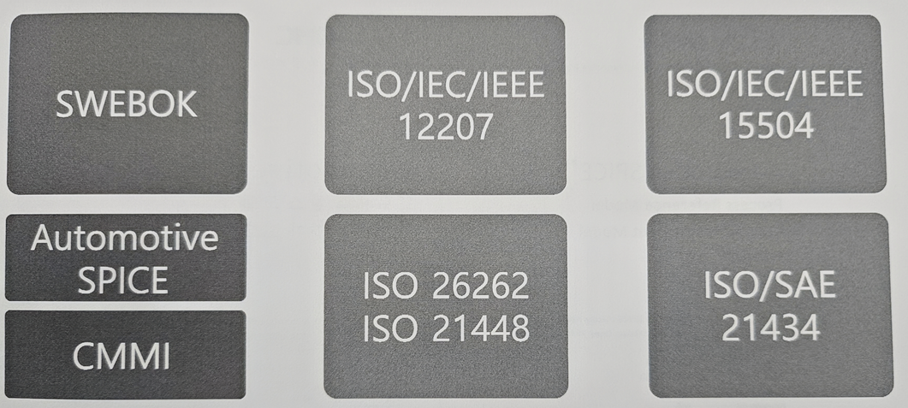
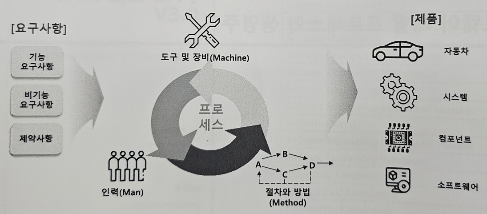
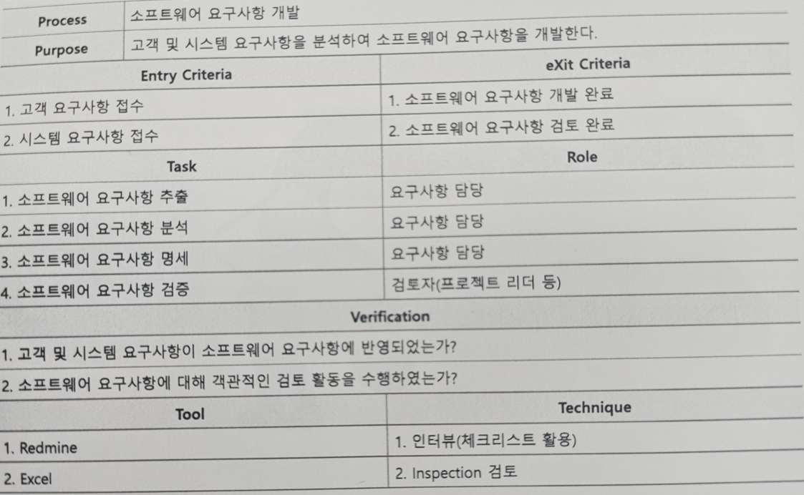

# 자동차 소프트웨어 개발 프로세스와 품질 관리의 이해

---

## 교육 목표
1. 자동차 소프트웨어 개발 프로세스의 필요성 인식
2. 자동차 소프트웨어 프로세스 표준(A-SPICE와 ISO 26262) 이해
3. 자동차 소프트웨어 개발 프로세스 단계별 활동과 산출물 이해

---

## 자동차 소프트웨어 개발 프로세스 개요

### 자동차 전장 시스템에서 소프트웨어의 중요성
- 차량의 안전, 편의, 성능을 좌우하는 핵심 요소로 자리잡음
- 소프트웨어의 정의와 특징, 공학적 접근의 필요성 인식
- 프로세스의 개념과 중요성, 소프트웨어 생명주기 이해

---

### 자동차의 전장화와 소프트웨어 시스템의 증가

#### 우리는 어떤 사회에 살고 있는가?
- **4차 산업혁명**: 인공지능, 사물인터넷, 자율주행 등 소프트웨어 중심의 사회
- **IoT 혁명**: 모든 사물이 네트워크로 연결되는 사회
- **자동차의 전장화**: 차량이 **SDV(Software Defined Vehicle)**로 진화, 소프트웨어가 핵심 역할
- 예시: 현대오토에버 - [모빌진](https://www.hyundai.co.kr/story/CONT0000000000107771)

#### 자동차 내 소프트웨어의 대형화
- 차량 내 소프트웨어 코드 규모는 약 2~3억 LOC (Lines of Code)에 달함

---

## 글로벌 자동차 OEM의 품질 요구사항

### 품질(Quality)이란 무엇인가?
- **명시적/묵시적 요구를 충족하는 능력**
- 주요 정의:
  - W.E.Demming: 품질은 고객의 요구를 만족시키는 것
  - J.M.Juran: 품질은 사용 목적에 일치되는 정도
  - P.B.Crosby: 품질은 고객 요구사항(기대)에 대한 적합도

### 품질의 두 가지 관점
- **프로세스 품질 (PDCA 사이클)**:
  - 목적을 달성하기 위한 프로세스 정의, 수행, 통제, 개선
- **제품 품질**:
  - 산출물의 추적성 및 일관성 확보
  - 고객 요구사항 만족 여부

→ **결론**: 프로세스 품질을 높여야 제품 품질도 향상된다.

---

## PDCA 사이클 (Plan-Do-Check-Act)

품질 관리 및 지속적 개선을 위한 반복적 관리 기법.

| 단계 | 내용 |
|---|---|
| Plan (계획) | 문제 정의, 목표 설정, 개선 계획 수립 |
| Do (실행) | 계획 실행, 문제 해결 활동 수행 |
| Check (점검) | 실행 결과 분석, 문제 여부 확인 |
| Act (조치) | 개선안 적용, 표준화 |

**특징**: 반복 수행을 통한 지속적 품질 및 프로세스 개선.

---

## 소프트웨어의 정의와 특징

### 소프트웨어의 정의
- 프로그램과 관련 문서의 집합
- 소스코드뿐 아니라 요구사항 명세서, 설계서, 테스트 케이스 등 포함

### 소프트웨어의 특징
- **비가시성(Invisibility)**: 내부 로직은 보이지 않음 → 아키텍처 및 설계 단계에서 가시성 확보 필요
- **비선형성(Non-linearity)**: 복잡한 구조 → 휴먼 에러 발생 가능성 증가
- **마모되지 않음**: 시간이 지나도 물리적 마모는 없지만 지속적인 변경 발생
- **사람 중심 작업**: 휴먼 에러 가능성 → 리뷰(코드, 요구사항, 설계) 필수
- **결론**: 코드만 보는 게 아니라, 프로세스를 따라 개발해야 고품질 소프트웨어 가능

### 소프트웨어 개발의 어려움
- QCD(품질, 비용, 납기) 만족의 어려움
- 산출물의 가시성 부족
- 오류 발견/해결 시점 지연
- 프로젝트 실패 가능성 증가

---

### QCD란? (Quality, Cost, Delivery)

| 항목 | 설명 |
|---|---|
| Quality (품질) | 오류 최소화, 사용자 만족도 |
| Cost (비용) | 개발/운영/유지보수 비용 |
| Delivery (납기) | 일정 준수 |

---

## 소프트웨어 공학에는 만병통치약은 없다
- 상황에 맞는 적절한 접근이 중요함

---

## Safety-Critical System에서 소프트웨어의 중요성

### 정의
- 오작동 시 인명, 재산, 환경에 심각한 피해를 초래할 수 있는 시스템

### 특징
- 안전성(Safety), 신뢰성(Reliability), 예측 가능성(Predictability)
- 엄격한 검증 및 인증 필요 (ISO 26262, DO-178C 등)

### 예시
- 항공: 비행 제어 시스템
- 자동차: 자율주행, ABS, 에어백
- 의료: 심장박동기, 인공호흡기
- 원자력: 원자로 제어
- 철도: 열차 제어, 신호 시스템

### 사례: Toyota 급발진 사고
- 원인:
  1. 소프트웨어 설계 사양서 부재
  2. 코딩 규칙 위반 (전역변수 남용 등)

---

## 소프트웨어 공학 개요

### 소프트웨어 공학의 정의와 목표
- 소프트웨어 개발/운용/유지보수의 공학적 접근
- 목표:
  - 생산성 및 재사용성 향상
  - 품질 향상
  - 비용 절감
  - 일정 준수

---

### 소프트웨어 품질 관리 및 표준

| 표준/모델 | 설명 | 목적 |
|---|---|---|
| ISO/IEC 15504 (SPICE) | 프로세스 성숙도 평가 | 프로세스 개선 및 평가 |
| ISO/IEC 12207 | 소프트웨어 생명주기 표준 | 전체 개발 및 관리 지침 |
| ISO/SAE 21434 | 자동차 사이버 보안 표준 | ECU/네트워크 보안 관리 |
| ISO 26262 | 자동차 기능 안전 표준 | Safety Critical System 안전 기준 |
| ISO 21448 (SOTIF) | 의도된 기능 안전성 | 위험 분석, 안전 설계 기준 |
| SWEBOK | SW 공학 지식체계 | SW 공학 지식과 가이드 |
| Automotive SPICE | 자동차 SW SPICE 모델 | 자동차 SW 프로세스 평가 |
| CMMI | 성숙도 모델 | 프로세스 성숙도 평가 및 개선 |

---

## 소프트웨어 개발 프로세스와 생명주기

### 프로세스의 정의
- 고객 요구사항을 만족하는 제품을 만들기 위한 **절차/방법, 도구/장비, 인력**의 통합

### 프로세스의 중요성
- 품질, 일정, 비용을 관리하고, 개발 실패를 방지하기 위해 필수적

### [[실습] 계획 수립이 중요한 이유 작성하기](실습/실습2.md)

---

## 소프트웨어 개발 프로세스의 정의
- 소프트웨어 개발에 필요한 **절차/방법**만이 아니라, 그와 관련된 **도구/장비, 인력**의 통합

---

## 프로세스 정의 방법: ETVX
- **E**ntry Criteria: 작업 착수 기준
- **T**ask: 수행 작업
- **V**erification: 검증 기준
- **eX**it Criteria: 완료 기준

[[실습] 소프트웨어 개발 관련 특정 프로세스 정의하기](실습/실습3.md)

---

## 요구사항과 설계의 차이

| 구분 | 설명 |
|---|---|
| 요구사항(What) | **무엇을** 해야 하는지에 대한 정의 (기능 명세, 목적) |
| 설계(How) | **어떻게** 구현할 것인지에 대한 구체적 계획 (구조, 방법, 도구 등) |

→ **요구사항 = 목적 / 문제 정의**  
→ **설계 = 해결 방법 및 구체화**

**보충 설명**:  
요구사항은 "무엇이 필요하다"라는 고객/사용자의 관점을 담고 있으며, 설계는 이를 실현하기 위해 시스템이 어떻게 동작하고, 각 부품이 어떤 역할을 하며, 어떤 방식으로 구현될지를 구체적으로 나타낸다.

---